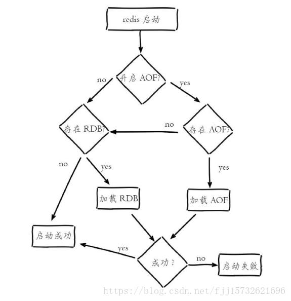

# redis


## Redis简介

```
1.Redis是一款可基于内存也可持久化的一款数据库，key-value数据库

2.Redis的优势
    Redis支持数据的持久化，可以将内存中的数据保存在磁盘中，重启的时候可以再次加载进行使用。
    Redis支持数据的备份，即master-slave模式的数据备份。
    性能极高,官方benchmark测试在50个并发执行100000个请求测试中,Redis能读的速度是110000次/s,写的速度是81000次/s。
    丰富的数据类型，Redis支持Strings, Lists, Hashes, Sets 及 Sorted Sets 数据类型操作。
    原子性，Redis的所有操作都是原子性的，同时Redis还支持对几个操作合后的原子性执行。
    丰富的特性，Redis还支持publish/subscribe(订阅)等特性。

3.Redis的数据类型
(1) string（字符串）
    string类型是二进制安全的。意思是redis的string可以包含任何数据。比如jpg图片或者序列化的对象。
    string类型是Redis最基本的数据类型，一个redis中字符串value最多可以是512M。

(2) hash（哈希）
    hash是一个键值对集合。
    hash是一个string类型的field和value的映射表，hash特别适合用于存储对象。

(3) list（列表）
    Redis列表是简单的字符串列表，按照插入顺序排序。你可以添加一个元素导列表的头部（左边）或者尾部（右边）。
    它的底层实际是个链表

(4) set（集合）
    Redis的Set是string类型的无序集合。它是通过HashTable实现的。

(5) zset(有序集合)
    Redis zset 和 set 一样也是string类型元素的集合,且不允许重复的成员。不同的是每个元素都会关联一个double类型的分数。
    redis正是通过分数来为集合中的成员进行从小到大的排序。zset的成员是唯一的,但分数(score)却可以重复。
```


## redis可视化

```
https://blog.csdn.net/leisure_life/article/details/78460632
sudo snap install redis-desktop-manager
```


## 缓存更新的套路

```
先更新数据库，再删除缓存。
(原因: 试想，两个并发操作，一个是更新操作，另一个是查询操作，更新操作删除缓存后，查询操作没有命中缓存，先把老数据读出来后放到缓存中，然后更新操作更新了数据库。于是，在缓存中的数据还是老的数据，导致缓存中的数据是脏的，而且还一直这样脏下去了。)
```

## 启动redis

```
(1) 指定端口启动
redis-server (--port xx)

(2) 指定配置文件启动
redis-server xxx.conf
```


## 清空数据库

```
r.flushall()                                    # (返回值: True或False)
```


## keys相关

```
del key [key ...]                               # 删除key(返回值: 1:成功 0:失败)

exists key [key ...]                            # key是否存在(返回值: True或False)

type key                                        # 获取key的存储类型(返回值: key的类型)

move key db                                     # key转移到指定db(返回值: True或False)

keys pattern                                    # 匹配key 例: r.keys('*') (返回值: key列表)

randomkey                                       # 随机获取一个key(返回值: key)

expire key seconds                              # 给key设置过期时间(返回值: True或False)
expireat key timestamp
pexpire key milliseconds
pexpireat key milliseconds-timestamp
persist key                                     # 移除key过期时间(返回值: True或False)
ttl key                                         # 获取key的有效秒数(返回值: 秒数)
pttl key                                        # 获取key的有效毫秒数(返回值: 毫秒数)

rename key newkey                               # 重命名一个key，当旧key和新key相同，或者旧key不存在时，返回一个错误。当新key已经存在时，rename命令将覆盖旧值(返回值: True或False)
renamenx key newkey                             # 重命名一个key，新的key必须是不存在的key(返回值: True或False)

****migrate host key destination-db timeout
****dump key (导出key的值)
****object
****restore
****sort
****wait
****scan
```

```
In [38]: r.ttl('sk1')

In [39]: r.type('sk1')
Out[39]: 'set'

In [40]: r.rename('sk1','sk3')
Out[40]: True

In [41]: r.randomkey()
Out[41]: 'sk2'

In [42]: r.pttl('sk1')

In [43]: r.persist('sk1')
Out[43]: False

In [44]: r.move('sk2',1)
Out[44]: True

In [45]: r.keys()
Out[45]: ['sk3']

In [47]: r.delete('sk1')
Out[47]: 0

In [49]: r.smembers('sk1')
Out[49]: set()

In [50]: r.exists('sk1')
Out[50]: False

In [51]: r.sadd('sk1',1)
Out[51]: 1

In [52]: r.exists('sk1')
Out[52]: True

In [53]: r.expire('sk1',4)
Out[53]: True

In [54]: r.exists('sk1')
Out[54]: True

In [55]: r.exists('sk1')
Out[55]: False
```


## set

```
scard key                               # 查看key中有几个成员(返回值: key中元素个数)

sadd key member [member ...]            # 向key添加元素(返回值: 1:成功, 0:失败)
srandmember key [count]                 # 从key里面随机获取一个元素(返回值: 获取的元素值)
spop key [count]                        # 从key删除一个元素(返回值: 删除的元素值)
srem key member [member ...]            # 从key删除指定元素(返回值: 1:成功, 0:失败)

sdiff key [key ...]                     # 获得第一个key中存在，其他key中不存在的元素(返回值: 元素集合)
sdiffstore destination key [key ...]    # 将第一个集合中存在其他集合中不存在的元素存储到指定的集合中，如果指定的集合已经存在，则将其覆盖(返回值: 差异元素个数)
sinter key [key ...]                    # 获得交集(返回值: 元素集合)
sinterstore destination key [key ...]   # 将给定集合之间的交集存储在指定的集合中。如果指定的集合已经存在，则将其覆盖(返回值: 元素个数)
sunion key [key ...]                    # 获得并集(返回值: 元素集合)
sunionstore destination key [key ...]   # 将给定集合之间的并集存储在指定的集合中。如果指定的集合已经存在，则将其覆盖(返回值: 元素个数)

sismember key member                    # 元素是否是key的成员(返回值: True或False)
smembers key                            # 获取集合里面的所有元素(返回值: 元素集合)

smove source destination member         # 移动元素(返回值: True或False)

****sscan
```

```
In [8]: r.flushall()
Out[8]: True

In [9]: r.keys()
Out[9]: []

In [10]: r.sadd('sk1',4)
Out[10]: 1

In [11]: r.sadd('sk1',5)
Out[11]: 1

In [12]: r.smembers('sk1')
Out[12]: {'4', '5'}

In [13]: r.sismember('sk1',5)
Out[13]: True

In [14]: r.sismember('sk1',3)
Out[14]: False

In [15]: r.scard('sk1')
Out[15]: 2

In [17]: r.spop('sk1')
Out[17]: '4'

In [18]: r.spop('sk1')
Out[18]: '5'

In [19]: r.sadd('sk1',1)
Out[19]: 1

In [20]: r.sadd('sk1',2)
Out[20]: 1

In [21]: r.smembers('sk1')
Out[21]: {'1', '2'}

In [22]: r.smove('sk1','sk2',2)
Out[22]: True

In [23]: r.smembers('sk1')
Out[23]: {'1'}

In [24]: r.smembers('sk2')
Out[24]: {'2'}

In [25]: r.sdiff('sk1','sk2')
Out[25]: {'1'}

In [26]: r.smembers('sk1')
Out[26]: {'1'}

In [27]: r.srandmember('sk1',1)
Out[27]: ['1']

In [28]: r.smembers('sk1')
Out[28]: {'1'}

In [29]: r.srem('sk1', 1)
Out[29]: 1

In [30]: r.smembers('sk1')
Out[30]: set()

In [32]: r.sadd('sk1',2)
Out[32]: 1

In [33]: r.sadd('sk1',3)
Out[33]: 1

In [34]: r.smembers('sk1')
Out[34]: {'2', '3'}

In [35]: r.smembers('sk2')
Out[35]: {'2'}

In [36]: r.sinter('sk1','sk2')
Out[36]: {'2'}

In [37]: r.sunion('sk1','sk2')
Out[37]: {'2', '3'}
```


## zset

```
zadd key score value                    # 向key中添加value及score(返回值: 1:成功 0:失败)

zcard key                               # 计算集合中元素的数量(返回值: 数量)

zcount key min max (-inf +inf)          # 返回分数范围内的成员数量(返回值: 数量)

zincrby key score value                 # score为想要增加的分数，可为正负。例: r.zincrby('zk2', 'value22', 10) (返回值: 运算结果值)

zscore key member                       # 获取key中成员的分数。例: r.zscore('zk2', 'value2') (返回值: 分数值)

------------------按排行
zrange key start stop [withscores]      # 成员按分数值递增的次序获取排行(返回值: ['value1', 'value2', 'value3']或[('value1', 20.0), ('value2', 110.0), ('value3', 400.0)])
zrevrange key start stop [withscores]   # 除了成员按分数值递减的次序排列这一点外，ZREVRANGE命令的其他方面和ZRANGE命令一样 (返回值: 同上)

------------------按分数
zrangebyscore key min max [withscores]  # r.zrangebyscore('zk2', 10, 1000, withscores=True) (返回值: 同上)
zrevrangebyscore key max min            # 成员按分数值递减 例: r.zrevrangebyscore('sk2', 100000, 2, withscores=True) (返回值: 同上)

zrank key member                        # 获取排名，第一名为1，依次类推。例: r.zrank('zk2', 'value22') (返回值: 排行值，如1,2,3)
zrevrank key value                      # 获取排名，第一名为0，依次类推	(返回值: 排行值，如0,1,2)

zrem key member [member ...]            # 从key中删除value。(返回值: 1:成功 0:失败)
zremrangebyscore key min max            # 删除分数范围内的成员 (返回值: 1:成功 0:失败)
zremrangebyrank key start stop          # 删除排名范围内的成员，第一名为0，依次类推 (返回值: 1:成功 0:失败)


****zlexcount key min max (- +) (返回成员之间的成员数量)
****zrangebylex key min max [limit offset count] (- +) (返回指定成员区间内的成员，按字典正序排列，分数必须相同)
****zrevrangebylex key max min [limit offset count] (+ -)
****zremrangebylex key min max (- +) (删除名称按字典由低到高排序成员之间所有成员)

****zinterstore
****zunionstore
****zscan
```

```
In [89]: r.flushall()
Out[89]: True

In [90]: r.zadd('zk1','value1',98)
Out[90]: 1

In [91]: r.zadd('zk1','value2',80)
Out[91]: 1

In [92]: r.zadd('zk1','value3',76)
Out[92]: 1

In [94]: r.zrangebyscore('zk1', 60, 88)
Out[94]: ['value3', 'value2']

In [95]: r.zrange('zk1',0,-1,withscores=True)
Out[95]: [('value3', 76.0), ('value2', 80.0), ('value1', 98.0)]

In [96]: r.zcard('zk1')
Out[96]: 3

In [97]: r.zcount('zk1',60,80)
Out[97]: 2L

In [98]: int(r.zcount('zk1',60,80))
Out[98]: 2

In [99]: r.zincrby('zk1','value3',1)
Out[99]: 77.0

In [100]: r.zrank('zk1','value3')
Out[100]: 0

In [102]: r.zrank('zk1','value1')
Out[102]: 2

In [103]: r.zrank('zk1','value2')
Out[103]: 1

In [104]: r.zrem('zk1','value1')
Out[104]: 1

In [105]: r.zcard('zk1')
Out[105]: 2

In [106]: r.zremrangebyscore('zk1',70,79)
Out[106]: 1

In [107]: r.zcard('zk1')
Out[107]: 1

In [108]: r.zadd('zk1','value4',12)
Out[108]: 1

In [109]: r.zrevrange('zk1',0,-1,withscores=True)
Out[109]: [('value2', 80.0), ('value4', 12.0)]

In [114]: r.zrevrank('zk1','value3')

In [115]: r.zrevrank('zk1','value2')
Out[115]: 0

In [116]: r.zscore('zk1','value2')
Out[116]: 80.0
```


## hash

```
hkeys key                                       # 查看该键所有field (返回值: 指定key中由field组成的列表。如: ['f1', 'f2', 'f3'])

hvals key                                       # 获取key中所有的value (返回值: 由value组成的列表，如: ['6', '16', '4'])

hlen key                                        # 指定key中field的个数 (返回值: 个数)

hset key field value                            # 为key设置field及value (返回值: 1和0都为成功，区别是1为field不存在时的返回值，0为field存在时的返回值)

hget key field                                  # 获取key中指定field的value值 (返回值: value)
hmget key field [field ...]                     # 取指定key中一个或多个field中的value (返回值: 由value值组成的列表)
hgetall key                                     # 获取key中的所有field:value键值对 (返回值: 由field和value为键值对组成的字典，如: {'f1': '3', 'f2': '4'})

hdel key field [field ...]                      # 删除key中的指定field (返回值: 删除field的个数，如: r.hdel('hk1', 'f1', 'f2', 'f3'))

hexists key field                               # key中的field是否存在 (返回值: True或False)

hincrby key field increment                     # 增/减指定key的指定field中的value值，increment为整数 (返回值: 运算后的value值)
hincrbyfloat key field increment                # 用法与hincrby相同，但是increment可为小数 (返回值: 同上)


hsetnx key field value                          # 为哈希表中不存在的的字段赋值。(返回值: 1为成功，0为失败)
如果哈希表不存在，一个新的哈希表被创建并进行HSET操作。
如果字段已经存在于哈希表中，操作无效。

hstrlen key field                               # 获取指定field中value的长度 (返回值: 长度)
In [198]: r.hset('hk1', 'f1', 6)
Out[198]: 1L
In [199]: r.hset('hk1', 'f2', 16)
Out[199]: 1L
In [200]: r.hstrlen('hk1', 'f1')
Out[200]: 1
In [201]: r.hstrlen('hk1', 'f2')
Out[201]: 2


***hmset key field value [field value ...]
***hscan key cursor [MATCH pattern] [COUNT count]
```


```
In [63]: r.flushall()
Out[63]: True

In [64]: r.hset('hk1','f1',1)
Out[64]: 1L

In [65]: r.hset('hk1','f1',2)
Out[65]: 0L

In [66]: r.hget('hk1','f1')
Out[66]: '2'

In [67]: r.hset('hk1','f1',3)
Out[67]: 0L

In [68]: r.hget('hk1','f1')
Out[68]: '3'

In [69]: r.hget('hk1','f1')
Out[69]: '3'

In [70]: r.hexists('hk1','f1')
Out[70]: True

In [71]: r.hgetall('hk1')
Out[71]: {'f1': '3'}

In [72]: r.hset('hk1','f2',4)
Out[72]: 1L

In [73]: r.hgetall('hk1')
Out[73]: {'f1': '3', 'f2': '4'}

In [74]: r.hkeys('hk1')
Out[74]: ['f1', 'f2']

In [75]: r.hlen('hk1')
Out[75]: 2

In [76]: r.hmget('hk1','f1','f2')
Out[76]: ['3', '4']

In [77]: r.hmget('hk1','f1')
Out[77]: ['3']

In [78]: r.hvals('hk1')
Out[78]: ['3', '4']

In [79]: r.hstrlen('hk1','f1')
Out[79]: 1

In [80]: r.hsetnx('hk1','f3',2)
Out[80]: 1L

In [81]: r.hincrby('hk1','f3')
Out[81]: 3L

In [82]: r.hget('hk1','f3')
Out[82]: '3'

In [83]: r.hincrbyfloat('hk1','f3')
Out[83]: 4.0

In [84]: r.hget('hk1','f3')
Out[84]: '4'

In [85]: r.hdel('hk1','f2')
Out[85]: 1

In [86]: r.hlen('hk1')
Out[86]: 2

In [87]: r.hdel('hk1','f1')
Out[87]: 1

In [88]: r.hlen('hk1')
Out[88]: 1
```


## string (value值无论是什么，都会变为字符串)

```
getset key value                                        # 设置一个key的value，并获取设置前的值。(返回值: 设置前的值)

get key                                                 # 获取指定key中的value值 (返回值: value值)
set key value [ex seconds] [px milliseconds] [nx|xx]    # 例: r.set('test', 100, ex=10) (返回值: True或False，若加期限则返回期限时间)
参数:
EX second       : 设置键的过期时间为 second 秒。 SET key value EX second 效果等同于 SETEX key second value 。
PX millisecond  : 设置键的过期时间为 millisecond 毫秒。 SET key value PX millisecond 效果等同于 PSETEX key millisecondvalue 。
NX              : 只在键不存在时，才对键进行设置操作。 SET key value NX 效果等同于 SETNX key value 。
XX              : 只在键已经存在时，才对键进行设置操作。

mset key value [key value ...]                          # key存在覆盖其值，key不存在添加key及其value。例: r.mset(**{'str1':1,'str3':2}) (返回值: True或False)
mget key [key ...]                                      # 指定key中的value值 (返回值: value值组成的列表)

setrange key offset value                               # 替换字符串指定位置的字符。例: r.setrange('test', 0, 'h') (返回值: 结果字符串长度)
getrange key start end                                  # 获取存储在key上的值的一个子字符串 (返回值: 结果字符串)

setnx key value                                         # key存在无影响，key不存在添加key及其value (返回值: True或False)
msetnx key value [key value ...]                        # key存在无影响，key不存在添加key及其value。例: r.msetnx(**{'str1':1,'str3':2}) (返回值: True或False)

setex key seconds value                                 # 为键设置时限，单位秒 (返回值: True或False)

strlen key                                              # 获取字符串长度 (返回值: 字符串长度)

append key value                                        # 追加一个值到key上，无论key存在与否。(返回值: 结果字符串长度)

decr key                                                # 整数原子减1 (返回值: 结果值)
incr key                                                # 整数原子加1操作 (返回值: 结果值)
incrby key increment                                    # 整数原子增加一个整数 (返回值: 结果值)
incrbyfloat key increment                               # 原子增加一个浮点数 (返回值: 结果值)


****bitcount key [start end] (统计字符串起始位置的字节数)
****bitfield
****bitop
****bitops
****setbit key offset value
****getbit key offset
****decrby key decrement (原子减指定的整数)
****psetex key milliseconds value (毫秒)
```


```
In [118]: r.flushall()
Out[118]: True

In [119]: r.set('strk1',1)
Out[119]: True

In [120]: r.setnx('strk1',2)
Out[120]: False

In [121]: r.setnx('strk2',2)
Out[121]: True

In [122]: r.strlen('strk1')
Out[122]: 1

In [124]: r.set('strk3',3)
Out[124]: True

In [125]: r.get('strk3')
Out[125]: '3'

In [127]: r.setex('strk3',5,4)
Out[127]: True

In [128]: r.get('strk3')
Out[128]: '5'

In [129]: r.get('strk3')

In [130]: r.incr('strk2')
Out[130]: 3

In [131]: r.incrby('strk2')
Out[131]: 4

In [132]: r.incrbyfloat('strk2')
Out[132]: 5.0

In [133]: r.getset('strk2',2)
Out[133]: '5'

In [134]: r.get('strk2')
Out[134]: '2'

In [135]: r.decr('strk2')
Out[135]: 1

In [136]: r.append('strk2',4)
Out[136]: 2L

In [137]: r.get('strk2')
Out[137]: '14'

In [138]: r.getrange('strk2',0,-1)
Out[138]: '14'

In [139]: r.getrange('strk2',0,1)
Out[139]: '14'

In [140]: r.getrange('strk2',0,0)
Out[140]: '1'

In [141]: r.keys()
Out[141]: ['strk2', 'strk1']

In [142]: r.mget('strk2','strk1')
Out[142]: ['14', '1']

In [144]: r.mset({'strk2':12,'strk1':13})
Out[144]: True

In [145]: r.mget('strk2','strk1')
Out[145]: ['12', '13']

In [148]: r.keys()
Out[148]: ['strk2', 'strk1']

In [149]: r.msetnx({'strk2':1,'strk1':2,'strk3':3})
Out[149]: False

In [150]: r.keys()
Out[150]: ['strk2', 'strk1']

In [151]: r.msetnx({'strk3':3})
Out[151]: True

In [152]: r.keys()
Out[152]: ['strk2', 'strk3', 'strk1']
```


## list

```
lrange key start stop                       # 获取列表指定范围内的值 (返回值: 结果列表)

lpush key value [value ...]                 # 从队列左边入队一个元素。例:r.lpush('lk1', 3, 4) (返回值: 列表长度)
lpushx key value                            # 当队列存在时，从队列左边入队一个元素 (返回值: 若key不存在，则返回0；若key存在，则返回列表长度)

rpush key value [value ...]                 # 从队列右边入队一个元素 (返回值: 同lpush)
rpushx key value                            # 当队列存在时，从队列右边入队一个元素 (返回值: 同lpushx)

llen key                                    # 获取指定key的value值长度 (返回值: 列表长度)

lindex key index                            # 获取value中指定index位置的值 (返回值: value值)

ltrim key start stop                        # 修剪到指定范围内的清单，包含start及stop位置的值 (返回值: True或False)

lset key index value                        # 修改指定key中index位置的值 (返回值: True或False)

linsert key before/after value              # r.linsert('list1','before','3',0) 在列表中值为'3'的元素前插入元素0。若列表有多个相同值，则对左数第一个做操作 (返回值: 列表长度)

lpop key                                    # 删除列表最左侧元素 (返回值: 列表最左侧的元素值)
rpop key
rpoplpush source destination                # 从原列表最右侧弹出一个列表的元素值，将它推到另一个列表的最左侧,并返回该元素值或无返回)

blpop key [key ...] timeout                 # 移出列表左侧第一个元素， 如果列表没有元素会阻塞列表直到等待超时或发现可弹出元素为止。(返回值: 元素值或None)
brpop key [key ...] timeout                 # 移出列表右侧第一个元素， 如果列表没有元素会阻塞列表直到等待超时或发现可弹出元素为止。(返回值: 元素值或None)
brpoplpush source destination timeout       # 弹出一个列表的值，将它推到另一个列表，并返回它或阻塞。例: r.brpoplpush('lk1', 'lk2', 10) (返回值: 元素值或None)

lrem key count value                        # 例: r.lrem('list1','a',5) 此时count值为5) (返回值: 1:成功 0:失败)
COUNT的值可以是以下几种：
1) count > 0 : 从表头开始向表尾搜索，移除与 VALUE 相等的元素，数量为 COUNT 。
2) count < 0 : 从表尾开始向表头搜索，移除与 VALUE 相等的元素，数量为 COUNT 的绝对值。
3) count = 0 : 移除表中所有与 VALUE 相等的值。
```


```
In [167]: r.flushall()
Out[167]: True

In [168]: r.lpush('lk1',1)
Out[168]: 1L

In [169]: r.lpush('lk1',2)
Out[169]: 2L

In [170]: r.lpush('lk1',3)
Out[170]: 3L

In [171]: r.llen('lk1')
Out[171]: 3

In [172]: r.lpush('lk2',4)
Out[172]: 1L

In [173]: r.lpush('lk2',5)
Out[173]: 2L

In [174]: r.lindex('lk1',2)
Out[174]: '1'

In [175]: r.lpop('lk2')
Out[175]: '5'

In [176]: r.lpop('lk2')
Out[176]: '4'

In [177]: r.lpop('lk2')

In [178]: r.lrange('lk1',0,-1)
Out[178]: ['3', '2', '1']

In [179]: r.lpushx('lk1',4)
Out[179]: 4

In [180]: r.lrange('lk1',0,-1)
Out[180]: ['4', '3', '2', '1']

In [181]: r.lrem('lk1',2,1)
Out[181]: 1L

In [182]: r.lrange('lk1',0,-1)
Out[182]: ['4', '3', '1']

In [183]: r.lset('lk1',0,5)
Out[183]: True

In [184]: r.lrange('lk1',0,-1)
Out[184]: ['5', '3', '1']

In [185]: r.ltrim('lk1',0,1)
Out[185]: True

In [186]: r.lrange('lk1',0,-1)
Out[186]: ['5', '3']

In [187]: r.rpush('lk1',2)
Out[187]: 3L

In [188]: r.lrange('lk1',0,-1)
Out[188]: ['5', '3', '2']

In [189]: r.rpushx('lk1',1)
Out[189]: 4

In [190]: r.lrange('lk1',0,-1)
Out[190]: ['5', '3', '2', '1']

In [191]: r.rpop('lk1')
Out[191]: '1'

In [192]: r.rpop('lk1')
Out[192]: '2'
```


# python连接redis


## python连接数据库

```
In [1]: import redis

In [2]: r = redis.Redis(host='127.0.0.1',port=6379,password='',db=0)

In [3]: r
Out[3]: Redis<ConnectionPool<Connection<host=127.0.0.1,port=6379,db=0>>>
```


## redis简单操作

```
import redis
redis_config = {
    'host': '192.138.16.70',
    'port': 6379,
}
r = redis.Redis(**redis_config)
r.set('li','you are very good!')
print r.get('li')
```


## redis连接池

```
import redis
def get_redis_connect():
    redis_config = {
	'host': '192.168.16.70',
	'port': 6379,
    }
    pool = redis.ConnectionPool(**redis_config)
    r = redis.Redis(connection_pool=pool)
    return r

if __name__ == '__main__':
    r = get_redis_connect()
    r.set('name', 'li')
    print r.get('name')
```


## redis管道

```
#可以一次执行多次redis命令
#应用管道后速度效率大大提升
def withpipe(r):
    pipe = r.pipeline(transaction=True)
    for i in xrange(1,1000):
	key = "tets1" + str(i)
	value = "test1" + str(i)
	pipe.set(key, value)
    pipe.execute()
```

## 项目实例

```
def make_redis_client(redis_config):
    try:
        if cmp(redis.VERSION, (2, 10, 1)) >= 0:
            pool = redis.BlockingConnectionPool(retry_on_timeout=True, **redis_config)
        else:
            pool = redis.BlockingConnectionPool(**redis_config)
    except:
        pool = redis.BlockingConnectionPool(**redis_config)

    redis_client = redis.Redis(connection_pool=pool)

    return redis_client
```


## 发布订阅

```
1.什么是发布订阅？
    Redis 发布订阅(pub/sub)是一种消息通信模式：发送者(pub)通过频道发送消息，订阅者(sub)通过频道接收消息。

2.使用场景
    广播、群聊、博客博主推送博文，订阅者同时接收到博文更新的消息、直播。

3.实现原理
    发送者(pub)通过频道发送消息，订阅者(sub)通过频道接收消息。

4.操作命令
(1)订阅一个或多个频道
    subscribe channel channel

(2)订阅多个匹配频道（需要正则表达式）
    psubscribe channel*

(3)发布订阅
    publish channel message

(4)取消订阅（客户端无法模拟取消订阅，因为客户端在订阅之后一直在等待接收消息，没法进行取消订阅操作）
    unsubscribe channel
```


## Redis事务

```
1.Redis 事务可以一次执行多个命令
2.事务操作命令
(1)开启事务
    MULTI
    
(2)执行事务
    EXEC

(3)取消事务（回滚）
    DISCARD

(4)监视key，如果在事务执行之前这个(或这些)key被其他命令所改动，那么事务将被打断
    WATCH key key2...

(5)取消监视
    UNWATCH
```


## Redis安全

```
1.密码设置
(1) 设置密码
    CONFIG set requirepass 密码
(2) 取消密码
    CONFIG set requirepass ""
(3) 输入密码
    AUTH 密码
(4) 查看redis的密码状况
    CONFIG get requirepass

2.数据的备份以及恢复（数据的导入与导出）
(1) 数据备份，会在服务端目录下生成dump.rdb文档
    SAVE
(2) 将生成的dump.rdb文档替换回路径，然后重启服务
```


## redis实际应用场景

```
1.排行榜
    使用原理：使用zset数据类型记录分数和实体，使用zrange通过分数进行排行显示
    漏洞：如果实体重名则无法存入到zset中，因为zset数据不能有重复数据

2.计数
    使用原理：使用string数据类型，值存计数，然后使用incr进行数值自增，实现下载量或浏览次数

3.消息队列
    使用原理：使用list数据类型与lpush-rpop模拟队列，遇到阻塞状态使用brpop
    解决：生产者消费者模式、订阅和发布模式

知识点补充：
(1) 生产者消费者模式：
    生产者生产数据到缓冲区中，消费者从缓冲区中取数据。
    如果缓冲区已经满了，则生产者线程阻塞；
    如果缓冲区为空，那么消费者线程阻塞。
```


## 主从配置

```
主从复制：http://blog.itpub.net/31545684/viewspace-2213629/
主从复制和哨兵：https://www.cnblogs.com/leeSmall/p/8398401.html
```

```
1.作用
    (1) 主从复制：主数据库将数据备份到从数据库中，保证数据一致性
    (2) 读写分离：主数据库可以进行写和读，然后从数据库进行读取，不能擅自更改数据库中的数据
    应用实例：分布式系统

2.原理
    (1) 当一个从数据库启动时，会向主数据库发送sync（同步请求）命令，
    (2) 主数据库接收到sync命令后会开始在后台保存快照（执行rdb操作），并将保存期间接收到的命令缓存起来
    (3) 当快照完成后，redis会将快照文件和所有缓存的命令发送给从数据库。
    (4) 从数据库收到后，会载入快照文件并执行收到的缓存的命令。

3.步骤
    (1) 在从机目录下打开配置文件，写slaveof <masterip> <masterport>
    (2) 打开从机服务端，自动连接主机
    (3) 打开从机客户端，查看数据是否与主机一致

4.哨兵作用——实现自动主从机切换
    (1) 监听Master状态（是否正常运行）
    (2) 如果Master运行异常，从全部从机中随机选择一个从机作为主机，并将其他从机改变从属目标，并且哨兵的监视对象变为现在的主机。
    (3) 如果原主机恢复正常运行，原主机将会变成从机。

5.哨兵配置（自动主从切换）
    (1) 主数据库目录中创建一个sentinel.conf配置文档
    (2) 配置文档中输入sentinel monitor 主机名 主机IP 主机端口号 投票数
    (3) 打开主机服务端，打开从机服务端
    (4) 打开一个窗口运行哨兵 redis-server sentinel.conf --sentinel
    (5) 关闭主数据库服务端，测试结果

6.注意
    主从配置使用哨兵时，无论数据库是主数据库还是从数据库，都要在目录下配置哨兵文件，并将哨兵监视IP指向自身
```


## 持久化

### 什么是持久化?

```
用一句话可以将持久化概括为：将数据(如内存中的对象)保存到可持久保存的存储设备中。

持久化的主要应用是将内存中的对象存储在数据库中，或者存储在磁盘文件中、XML数据文件中等等。

也可以从如下两个层面来理解持久化：
    应用层：如果关闭( Close )你的应用，然后重新启动则先前的数据依然存在。
    系统层：如果关闭( Shut Down )你的系统(电脑)，然后重新启动则先前的数据依然存在。
```

### redis为什么要持久化?

```
为了保证效率，数据都是缓存在内存中。

因为数据都是缓存在内存中的，当你重启系统或者关闭系统后，缓存在内存中的数据都会消失殆尽，再也找不回来了。

所以，为了让数据能够长期保存，就要将 Redis 放在缓存中的数据做持久化存储。
```

### redis怎么实现持久化?

```
1. RDB 持久化方式能够在指定的时间间隔对你的数据进行快照存储。
2. AOF 持久化方式记录每次对服务器写的操作，当服务器重启的时候会重新执行这些命令来恢复原始的数据。
3. 也可以同时开启两种持久化方式，在这种情况下，当 Redis 重启的时候会优先载入 AOF 文件来恢复原始的数据，因为在通常情况下 AOF 文件保存的数据集要比 RDB 文件保存的数据集要完整。

如果你只希望你的数据在服务器运行的时候存在，你也可以不使用任何持久化方式。
```

### 优缺点

```
优点对比总结：
    RDB 方式可以保存过去一段时间内的数据，并且保存结果是一个单一的文件，可以将文件备份到其他服务器，并且在回复大量数据的时候，RDB 方式的速度会比 AOF 方式的回复速度要快。
    AOF 方式默认每秒钟备份 1 次，频率很高，它的操作方式是以追加的方式记录日志而不是数据，并且它的重写过程是按顺序进行追加，所以它的文件内容非常容易读懂。可以在某些需要的时候打开 AOF 文件对其编辑，增加或删除某些记录，再执行恢复操作。

缺点对比总结：
    RDB 由于备份频率不高，所以在回复数据的时候有可能丢失一小段时间的数据，而且在数据集比较大的时候有可能对毫秒级的请求产生影响。
    AOF 的文件提及比较大，而且由于保存频率很高，所以整体的速度会比 RDB 慢一些，但是性能依旧很高。
```


### RDB 方式与 AOF 方式的优点对比

```
RDB 方式的优点：
    RDB 是一个非常紧凑的文件,它保存了某个时间点的数据集，非常适用于数据集的备份。
    比如你可以在每个小时保存一下过去 24 小时内的数据，同时每天保存过去 30 天的数据，这样即使出了问题你也可以根据需求恢复到不同版本的数据集。
    RDB 是一个紧凑的单一文件，很方便传送到另一个远端数据中心，非常适用于灾难恢复。
    RDB 在保存 RDB 文件时父进程唯一需要做的就是 Fork 出一个子进程，接下来的工作全部由子进程来做，父进程不需要再做其他 IO 操作，所以 RDB 持久化方式可以***化 Redis 的性能。
    与 AOF 相比，在恢复大的数据集的时候，RDB 方式会更快一些。
    
    当 Redis 需要保存 dump.rdb 文件时， 服务器执行以下操作：
        Redis 调用 Forks，同时拥有父进程和子进程。
        子进程将数据集写入到一个临时 RDB 文件中。
        当子进程完成对新 RDB 文件的写入时，Redis 用新 RDB 文件替换原来的 RDB 文件，并删除旧的 RDB 文件。
    这种工作方式使得 Redis 可以从写时复制(copy-on-write)机制中获益。


AOF 方式的优点：
    使用 AOF 会让你的 Redis 更加耐久。
    Redis 的性能依然很好( Fsync 是由后台线程进行处理的，主线程会尽力处理客户端请求)，一旦出现故障，你最多丢失 1 秒的数据。
    AOF文件是一个只进行追加的日志文件，所以不需要写入 Seek，即使由于某些原因(磁盘空间已满，写的过程中宕机等等)未执行完整的写入命令，你也可使用 redis-check-aof 工具修复这些问题。
    Redis 可以在 AOF 文件体积变得过大时，自动地在后台对 AOF 进行重写： 重写后的新 AOF 文件包含了恢复当前数据集所需的最小命令集合。
    整个重写操作是绝对安全的，因为 Redis 在创建新 AOF 文件的过程中，会继续将命令追加到现有的 AOF 文件里面，即使重写过程中发生停机，现有的 AOF 文件也不会丢失。
    而一旦新 AOF 文件创建完毕，Redis 就会从旧 AOF 文件切换到新 AOF 文件，并开始对新 AOF 文件进行追加操作。
    AOF 文件有序地保存了对数据库执行的所有写入操作，这些写入操作以 Redis 协议的格式保存。
    因此 AOF 文件的内容非常容易被人读懂， 对文件进行分析(parse)也很轻松。导出(export) AOF 文件也非常简单。

    举个例子，如果你不小心执行了 FLUSHALL 命令，但只要 AOF 文件未被重写，那么只要停止服务器， 移除 AOF 文件末尾的 FLUSHALL 命令，并重启 Redis ，就可以将数据集恢复到 FLUSHALL 执行之前的状态。


优点对比总结：
    RDB 方式可以保存过去一段时间内的数据，并且保存结果是一个单一的文件，可以将文件备份到其他服务器，并且在回复大量数据的时候，RDB 方式的速度会比 AOF 方式的回复速度要快。
    AOF 方式默认每秒钟备份 1 次，频率很高，它的操作方式是以追加的方式记录日志而不是数据，并且它的重写过程是按顺序进行追加，所以它的文件内容非常容易读懂。
        可以在某些需要的时候打开 AOF 文件对其编辑，增加或删除某些记录，再执行恢复操作。
```


### RDB 方式与 AOF 方式的缺点对比

```
RDB 方式的缺点：
    如果你希望在 Redis 意外停止工作(例如电源中断)的情况下丢失的数据最少的话，那么 RDB 不适合你。
    虽然你可以配置不同的 Save 时间点(例如每隔 5 分钟并且对数据集有 100 个写的操作)，但是 Redis 要完整的保存整个数据集是一个比较繁重的工作。
    你通常会每隔 5 分钟或者更久做一次完整的保存，万一 Redis 意外宕机，你可能会丢失几分钟的数据。
    RDB 需要经常 Fork 子进程来保存数据集到硬盘上，当数据集比较大的时，Fork 的过程是非常耗时的，可能会导致 Redis 在一些毫秒级内不能响应客户端的请求。
    如果数据集巨大并且 CPU 性能不是很好的情况下，这种情况会持续 1 秒，AOF 也需要 Fork，但是你可以调节重写日志文件的频率来提高数据集的耐久度。


AOF 方式的缺点：
    对于相同的数据集来说，AOF 文件的体积通常要大于 RDB 文件的体积。
    根据所使用的 Fsync 策略，AOF 的速度可能会慢于 RDB。在一般情况下，每秒 Fsync 的性能依然非常高，而关闭 Fsync 可以让 AOF 的速度和 RDB 一样快，即使在高负荷之下也是如此。


缺点对比总结：
    RDB 由于备份频率不高，所以在回复数据的时候有可能丢失一小段时间的数据，而且在数据集比较大的时候有可能对毫秒级的请求产生影响。
    AOF 的文件提及比较大，而且由于保存频率很高，所以整体的速度会比 RDB 慢一些，但是性能依旧很高。
```


### 工作方式选择

```
1. 对于企业级的中大型应用，如果不想牺牲数据完整性但是又希望保持高效率，那么你应该同时使用 RDB 和 AOF 两种方式。
2. 如果你不打算耗费精力在这个地方，只需要保证数据完整性，那么优先考虑使用 AOF 方式。
3. RDB 方式非常适合大规模的数据恢复，如果业务对数据完整性和一致性要求不高，RDB 是很好的选择。
```


### RDB 与 AOF 工作原理

```
RDB 工作原理：
    Redis 调用 Forks，同时拥有父进程和子进程。
    子进程将数据集写入到一个临时 RDB 文件中。
    当子进程完成对新 RDB 文件的写入时，Redis 用新 RDB 文件替换原来的 RDB 文件，并删除旧的 RDB 文件。

AOF 重写和 RDB 创建快照一样，都巧妙地利用了写时复制机制：
    Redis 执行 fork() ，现在同时拥有父进程和子进程。
    子进程开始将新 AOF 文件的内容写入到临时文件。
    对于所有新执行的写入命令，父进程一边将它们累积到一个内存缓存中，一边将这些改动追加到现有 AOF 文件的末尾，这样即使在重写的中途发生停机，现有的 AOF 文件也还是安全的。
    当子进程完成重写工作时，它给父进程发送一个信号，父进程在接收到信号之后，将内存缓存中的所有数据追加到新 AOF 文件的末尾。
    现在 Redis 原子地用新文件替换旧文件，之后所有命令都会直接追加到新 AOF 文件的末尾。
```

### Redis持久化文件加载流程

<div align=center>

