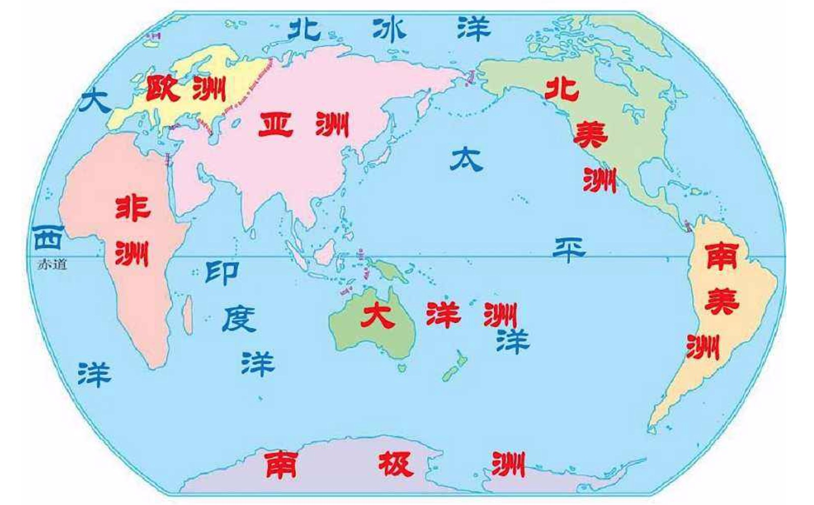
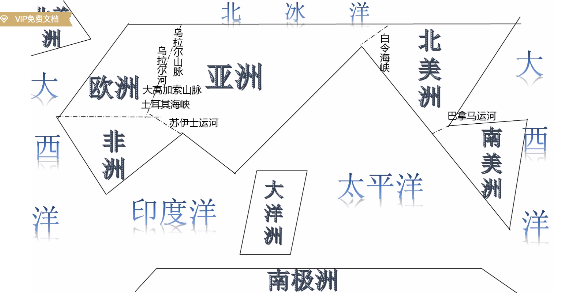
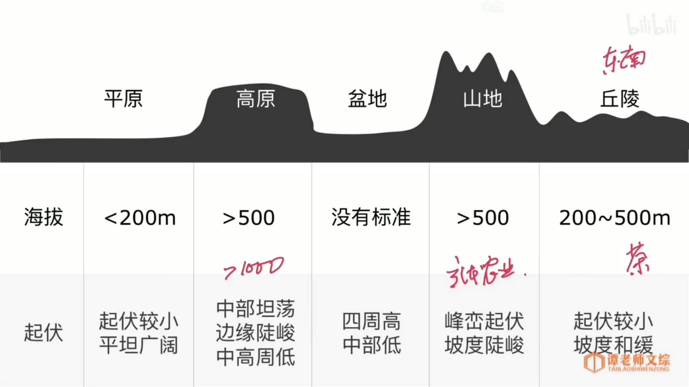
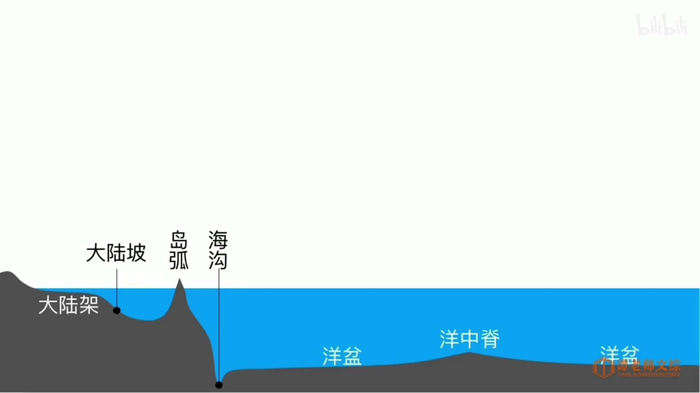

## 世界地理

### 总览

```
七大洲：（面积大->小）亚洲、非洲、北美洲、南美洲、南极洲、欧洲、大洋洲
四大洋：（面积大->小）太平洋、大西洋、印度洋、北冰洋

三分陆地29%
七分海洋71%

陆半球（北半球）
水半球（南半球）
```

<div align=center>


<div align=center>



### 七大洲国家分布

```
2012年世界上共有237个国家和地区，其中国家为197个，地区为40个。
 
（目前，得到全世界各国普遍承认独立的国家有197个，其中193个是联合国会员国，2个（梵蒂冈、巴勒斯坦）是联合国观察员国；奥运会上只有204个国家或地区参加。）
 说明：
1. 中国台湾：目前有20多个国家承认并建交，但中华人民共和国不承认；
2. 南奥塞梯和阿布哈兹：从格鲁吉亚独立，只有俄罗斯等个别国家承认，中国不承认；
3. 纳戈尔诺－卡拉巴赫：从阿塞拜疆独立，没有国家承认；
4. 北塞浦路斯：从塞浦路斯独立，只有土耳其承认；
5. 马耳他骑士团：得到了90多个国家的承认，中国不承认；
6. 科索沃：从塞尔维亚独立，得到了近70个国家的承认，中国不承认；
7. 德涅斯特左岸：从摩尔多瓦独立，没有国家承认；
8. 撒拉威阿拉伯民主共和国：得到了50多个国家承认，中国不承认；
9. 索马里兰、邦特兰、西南索马里等：从索马里独立，没有国家承认。

附：世界国家和地区及其首都或首府一览（国家用3位数字编号，地区用R+2位数字编号）：


非洲（54国家，7地区）
编号　国家或地区名　　　　　　　首都或首府
----------------------------------------------------------------
091 　埃及　　　　　　　　　　　开罗
092 　利比亚　　　　　　　　　　的黎波里
093 　突尼斯　　　　　　　　　　突尼斯
094 　阿尔及利亚　　　　　　　　阿尔及尔
095 　摩洛哥　　　　　　　　　　拉巴特
R05 　马德拉（葡）　　　　　　　丰沙尔
R06 　加那利群岛（西）　　　　　拉斯帕尔马斯
R07 　亚速尔（葡）　　　　　　　蓬塔德尔加达
R08 　西撒哈拉（撒拉威）　　　　阿尤恩
096 　毛里塔尼亚　　　　　　　　努瓦克肖特
097 　马里　　　　　　　　　　　巴马科
098 　塞内加尔　　　　　　　　　达喀尔
099 　冈比亚　　　　　　　　　　班珠尔
100 　佛得角　　　　　　　　　　普拉亚
101 　塞拉利昂　　　　　　　　　弗里敦
102 　几内亚　　　　　　　　　　科纳克里
103 　几内亚比绍　　　　　　　　比绍
104 　布基纳法索　　　　　　　　瓦加杜古
105 　利比里亚　　　　　　　　　蒙罗维亚
106 　科特迪瓦　　　　　　　　　亚穆苏克罗
107 　加纳　　　　　　　　　　　阿克拉
108 　多哥　　　　　　　　　　　洛美
109 　贝宁　　　　　　　　　　　波多诺伏
110 　尼日利亚　　　　　　　　　阿布贾
111 　尼日尔　　　　　　　　　　尼亚美
112 　乍得　　　　　　　　　　　恩贾梅纳
113 　中非　　　　　　　　　　　班吉
114 　喀麦隆　　　　　　　　　　雅温得
115 　赤道几内亚　　　　　　　　马拉博
116 　圣多美和普林西比　　　　　圣多美
117 　苏丹　　　　　　　　　　　喀土穆
118 　埃塞俄比亚　　　　　　　　亚得斯亚贝巴
119 　厄立特里亚　　　　　　　　阿斯马拉
120 　吉布提　　　　　　　　　　吉布提市
121 　索马里　　　　　　　　　　摩加迪沙
122 　肯尼亚　　　　　　　　　　内罗毕
123 　坦桑尼亚　　　　　　　　　达累斯萨拉姆
124 　乌干达　　　　　　　　　　坎帕拉
125 　卢旺达　　　　　　　　　　基加利
126 　布隆迪　　　　　　　　　　布琼布拉
127 　加蓬　　　　　　　　　　　利伯维尔
128 　刚果　　　　　　　　　　　布拉柴维尔
129 　刚果民主共和国　　　　　　金沙萨
130 　安哥拉　　　　　　　　　　罗安达
131 　赞比亚　　　　　　　　　　卢萨卡
132 　马拉维　　　　　　　　　　利隆圭
133 　莫桑比克　　　　　　　　　马普托
134 　科摩罗　　　　　　　　　　莫罗尼
R09 　马约特（法）　　　　　　　马穆楚
135 　马达加斯加　　　　　　　　塔那那利佛
136 　毛里求斯　　　　　　　　　路易港
R10 　留尼汪（法）　　　　　　　圣但尼
137 　塞舌尔　　　　　　　　　　维多利亚
138 　津巴布韦　　　　　　　　　哈拉雷
139 　博茨瓦纳　　　　　　　　　哈博罗内
140 　纳米比亚　　　　　　　　　温得和克
141 　南非　　　　　　　　　　　比勒陀利亚
142 　莱索托　　　　　　　　　　马塞卢
143 　斯威士兰　　　　　　　　　姆巴巴内
197   南苏丹                 朱巴
R11 　圣赫勒拿、阿森松和特里斯　詹姆斯敦坦·达库尼亚（英）


亚洲（48国家，1地区）
编号　国家或地区名　　　　　　　首都或首府
----------------------------------------------------------------
001 　中华人民共和国　　　　　　北京
R01 　中国台湾　　　　　       台北
002 　蒙古　　　　　　　　　　　乌兰巴托
003 　朝鲜　　　　　　　　　　　平壤
004 　韩国　　　　　　　　　　　首尔
005 　日本　　　　　　　　　　　东京
006 　越南　　　　　　　　　　　河内
007 　老挝　　　　　　　　　　　万象
008 　柬埔寨　　　　　　　　　　金边
009 　泰国　　　　　　　　　　　曼谷
010 　缅甸　　　　　　　　　　　内比都
011 　菲律宾　　　　　　　　　　马尼拉
012 　马来西亚　　　　　　　　　吉隆坡
013 　新加坡　　　　　　　　　　新加坡
014 　文莱　　　　　　　　　　　斯里巴加湾市
015 　印度尼西亚　　　　　　　　雅加达
016 　东帝汶　　　　　　　　　　帝力
017 　尼泊尔　　　　　　　　　　加德满都
018 　不丹　　　　　　　　　　　廷布
019 　印度　　　　　　　　　　　新德里
020 　巴基斯坦　　　　　　　　　伊斯兰堡
021 　孟加拉国　　　　　　　　　达卡
022 　斯里兰卡　　　　　　　　　科伦坡
023 　马尔代夫　　　　　　　　　马累
024 　哈萨克斯坦　　　　　　　　阿斯塔纳
025 　吉尔吉斯斯坦　　　　　　　比什凯克
026 　塔吉克斯坦　　　　　　　　杜尚别
027 　乌兹别克斯坦　　　　　　　塔什干
028 　土库曼斯坦　　　　　　　　阿什哈巴德
029 　阿富汗　　　　　　　　　　喀布尔
030 　伊朗　　　　　　　　　　　德黑兰
031 　格鲁吉亚　　　　　　　　　第比利斯
032 　亚美尼亚　　　　　　　　　埃里温
033 　阿塞拜疆　　　　　　　　　巴库
034 　伊拉克　　　　　　　　　　巴格达
035 　科威特　　　　　　　　　　科威特
036 　叙利亚　　　　　　　　　　大马士革
037 　黎巴嫩　　　　　　　　　　贝鲁特
038 　土耳其　　　　　　　　　　安卡拉
039 　塞浦路斯　　　　　　　　　尼科西亚
040 　以色列　　　　　　　　　　耶路撒冷
194 　巴勒斯坦　　　　　　　　　耶路撒冷
041 　约旦　　　　　　　　　　　安曼
042 　沙特阿拉伯　　　　　　　　利雅得
043 　巴林　　　　　　　　　　　麦纳麦
044 　卡塔尔　　　　　　　　　　多哈
045 　阿拉伯联合酋长国　　　　　阿布扎比
046 　阿曼　　　　　　　　　　　马斯喀特
047 　也门　　　　　　　　　　　亚丁


欧洲（44国家，3地区）
编号　国家或地区名　　　　　　　首都或首府
----------------------------------------------------------------
048 　挪威　　　　　　　　　　　奥斯陆
049 　瑞典　　　　　　　　　　　斯德哥尔摩
050 　芬兰　　　　　　　　　　　赫尔辛基
051 　丹麦　　　　　　　　　　　哥本哈根
052 　冰岛　　　　　　　　　　　雷克雅未克
R02 　法罗群岛（丹）　　　　　　托尔斯港
053 　爱沙尼亚　　　　　　　　　塔林
054 　拉脱维亚　　　　　　　　　里加
055 　立陶宛　　　　　　　　　　维尔纽斯
056 　俄罗斯　　　　　　　　　　莫斯科
057 　白俄罗斯　　　　　　　　　明斯克
058 　乌克兰　　　　　　　　　　基辅
059 　摩尔多瓦　　　　　　　　　基希讷乌
060 　波兰　　　　　　　　　　　华沙
061 　德国　　　　　　　　　　　柏林
062 　捷克　　　　　　　　　　　布拉格
063 　斯洛伐克　　　　　　　　　布拉迪斯拉发
064 　奥地利　　　　　　　　　　维也纳
065 　瑞士　　　　　　　　　　　伯尔尼
066 　列支敦士登　　　　　　　　瓦杜兹
067 　匈牙利　　　　　　　　　　布达佩斯
068 　斯洛文尼亚　　　　　　　　卢布尔雅那
069 　克罗地亚　　　　　　　　　萨格勒布
070 　波斯尼亚和黑塞哥维那　　　萨拉热窝
071 　塞尔维亚　　　　　　　　　贝尔格莱德
R03 　科索沃　　　　　　　　　　普里什蒂纳
072 　黑山　　　　　　　　　　　波德戈里察
073 　马其顿　　　　　　　　　　斯科普里
074 　罗马尼亚　　　　　　　　　布加勒斯特
075 　保加利亚　　　　　　　　　索非亚
076 　阿尔巴尼亚　　　　　　　　地拉那
077 　希腊　　　　　　　　　　　雅典
078 　英国　　　　　　　　　　　伦敦
079 　爱尔兰　　　　　　　　　　都柏林
080 　荷兰　　　　　　　　　　　阿姆斯特丹
081 　比利时　　　　　　　　　　布鲁塞尔
082 　卢森堡　　　　　　　　　　卢森堡
083 　法国　　　　　　　　　　　巴黎
084 　摩纳哥　　　　　　　　　　摩纳哥
085 　安道尔　　　　　　　　　　安道尔
086 　西班牙　　　　　　　　　　马德里
R04 　直布罗陀（英）　　　　　　直布罗陀
087 　葡萄牙　　　　　　　　　　里斯本
088 　意大利　　　　　　　　　　罗马
193 　梵蒂冈　　　　　　　　　　梵蒂冈城
089 　圣马力诺　　　　　　　　　圣马力诺
090 　马耳他　　　　　　　　　　瓦莱塔


北美洲（23国家，18地区）
编号　国家或地区名　　　　　　　首都或首府
----------------------------------------------------------------
158 　加拿大　　　　　　　　　　渥太华
R23 　格陵兰（丹）　　　　　　　努克
R24 　圣皮埃尔和密克隆（法）　　圣皮埃尔
159 　美国　　　　　　　　　　　华盛顿
R25 　百慕大（英）　　　　　　　哈密尔顿
160 　墨西哥　　　　　　　　　　墨西哥城
161 　危地马拉　　　　　　　　　危地马拉城
162 　伯利兹　　　　　　　　　　贝尔莫潘
163 　萨尔瓦多　　　　　　　　　圣萨尔瓦多
164 　洪都拉斯　　　　　　　　　特古西加尔巴
165 　尼加拉瓜　　　　　　　　　马那瓜
166 　哥斯达黎加　　　　　　　　圣何塞
167 　巴拿马　　　　　　　　　　巴拿马城
168 　巴哈马　　　　　　　　　　拿骚
R26 　特克斯群岛和凯科斯群岛　　科伯恩城（英）
169 　古巴　　　　　　　　　　　哈瓦那
170 　牙买加　　　　　　　　　　金斯敦
R27 　开曼群岛（英）　　　　　　乔治敦
171 　海地　　　　　　　　　　　太子港
172 　多米尼加　　　　　　　　　圣多明各
R28 　波多黎各（美）　　　　　　圣胡安
R29 　美属维尔京群岛　　　　　　夏洛特阿马利亚
R30 　英属维尔京群岛　　　　　　罗德城
R31 　安圭拉（英）　　　　　　　瓦利
173 　安提瓜和巴布达　　　　　　圣约翰
R32 　法属圣马丁　　　　　　　　马尔戈
R33 　荷属圣马丁　　　　　　　　菲利普斯堡
R34 　圣巴泰勒米（法）　　　　　古斯塔维亚
174 　圣基茨和尼维斯　　　　　　巴斯特尔
R35 　蒙特塞拉特（英）　　　　　普利茅斯
R36 　瓜德罗普（法）　　　　　　巴斯特尔
175 　多米尼克　　　　　　　　　罗索
R37 　马提尼克（法）　　　　　　法西兰堡
176 　圣卢西亚　　　　　　　　　卡斯特里
177 　圣文森斯和格林纳丁斯　　　金斯敦
178 　格林纳达　　　　　　　　　圣乔治
179 　巴巴多斯　　　　　　　　　布里奇敦
180 　特立尼达和多巴哥　　　　　西班牙港
R38 　荷属安的列斯　　　　　　　克拉伦代克
R39 　库拉索（荷）　　　　　　　威廉斯塔德
R40 　阿鲁巴（荷）　　　　　　　奥拉涅斯塔德


大洋洲（14国家，9地区）
编号　国家或地区名　　　　　　　首都或首府
----------------------------------------------------------------
144 　澳大利亚　　　　　　　　　堪培拉
145 　新西兰　　　　　　　　　　惠灵顿
146 　巴布亚新几内亚　　　　　　莫尔兹比港
147 　所罗门群岛　　　　　　　　霍尼亚拉
148 　瓦努阿图　　　　　　　　　维拉港
R12 　新喀里多尼亚（法）　　　　努美阿
149 　帕劳　　　　　　　　　　　科罗尔
150 　密克罗尼西亚联邦　　　　　帕利基尔
151 　马绍尔群岛　　　　　　　　马朱罗
R13 　北马里亚纳群岛（美）　　　塞班
R14 　关岛（美）　　　　　　　　阿加尼亚
152 　瑙鲁　　　　　　　　　　　亚伦
153 　基里巴斯　　　　　　　　　塔拉瓦
154 　斐济群岛　　　　　　　　　苏瓦
155 　汤加　　　　　　　　　　　努库阿洛法
156 　图瓦卢　　　　　　　　　　丰阿法莱
R15 　瓦利斯和富图纳（法）　　　马塔乌图
157 　萨摩亚　　　　　　　　　　阿皮亚
R16 　美属萨摩亚　　　　　　　　帕果帕果
R17 　托克劳（新）　　　　　　　努库诺努、法考福、阿塔富
195 　纽埃（新）　　　　　　　　阿洛菲
196 　库克群岛（新）　　　　　　阿瓦鲁阿
R18 　法属波利尼西亚　　　　　　帕皮提
R19 　皮特凯恩群岛（英）　　　　亚当斯敦
R20 　夏威夷（美）　　　　　　　火奴鲁鲁


南美洲（12国家，2地区）
编号　国家或地区名　　　　　　　首都或首府
----------------------------------------------------------------
181 　哥伦比亚　　　　　　　　　圣菲波哥大
182 　委内瑞拉　　　　　　　　　加拉加斯
183 　圭亚那　　　　　　　　　　乔治敦
184 　苏里南　　　　　　　　　　帕拉马里博
R21 　法属圭亚那　　　　　　　　卡宴
185 　厄瓜多尔　　　　　　　　　基多
186 　秘鲁　　　　　　　　　　　利马
187 　玻利维亚　　　　　　　　　拉巴斯
188 　巴拉圭　　　　　　　　　　亚松森
189 　智利　　　　　　　　　　　圣地亚哥
190 　巴西　　　　　　　　　　　巴西利亚
191 　乌拉圭　　　　　　　　　　蒙得维的亚
192 　阿根廷　　　　　　　　　　布宜诺斯艾利斯
R22 　福克兰群岛（英、阿争议）　斯坦利港
```


### 陆地

```
大陆：面积广大而完整的陆地（亚欧大陆世界最大 澳大利亚大陆世界最小）
岛屿：散布于海洋、湖泊或河流中面积较小的陆地（格陵兰岛世界最大）
半岛：一面与陆地相连，三面被水包围的陆地
洲：大陆和它附近的岛屿合起来称为大洲


陆地地形：
    海拔      起伏
平原 <200m    起伏较小、平坦广阔
高原 >500m    中部坦荡、边缘陡峻、中高周低
盆地 无        四周高、中部低
山地 >500m    峰峦起伏、坡度陡峻
丘陵 200~500m 起伏较小、坡度和缓

```

<div align=center>



### 海洋

```
洋：远离大陆的广阔水域，海洋的主体部分
海：海洋的边缘部分
海峡：沟通两个海域之间的狭窄水道
内海：指被陆地包围或通过狭窄水道连接海洋的海域（渤海）


        特色                                  与洲关系
太平洋  面积最大，全球海洋一半                   夹在亚洲、大洋洲、南极洲和南、北美洲之间
       马里亚纳海沟，世界大洋最深处，11034米        
       岛屿最多（45%），主要位于东半球
                    
大西洋  面积2大，占1/4，深度3深                  夹在欧洲、非洲、南极洲和南、北美洲之间
       形如S
                             
印度洋  面积3大，深度2深                        夹在亚洲、大洋洲、南极洲、非洲之间
       全部在东半球
       
北冰洋  面积最小、深度最浅                       夹在亚洲、欧洲、北美洲之间
       全在北半球的大洋


海底地形类型：
        中心水深            成因                                      特点                                          位置
大陆架     200m以内                                                  深度浅，坡度缓，光照、营养物质和海洋生物丰富       其宽度从低潮线起向海洋方向延伸至坡度显著增大的地方为止
大陆坡     200m-4000m                                                坡度大                                       大陆架向外延伸的部分
岛弧                      大陆板块受挤压上拱隆起形成                    弧形分布                                      大陆边缘与洋盆的过渡地带，分布于大陆坡的前缘  
海沟                      板块俯冲带动洋底下倾、陷落形成                 深度大                                       岛弧外缘，一般是大陆坡与洋盆的分界线
洋盆      4000m-6000m     地幔物质的对流向两侧推开，海底不断扩张形成      深度大，地壳运动相对稳定，地形较为平坦             海沟与洋中脊之间
洋中脊                    洋壳在地幔物质对流上升的顶托作用下形成          中轴为裂谷，其两侧群峰对峙，内壁陡峻              大洋
```

<div align=center>



### 补充

```
气温影响因素：
纬度位置：气温从低纬度向两极递减。
海陆位置：同纬度，夏季陆地气温高于海洋，冬季相反。
洋流因素：暖流流经的地区气温较高，寒流流经的地区气温较低。
地形因素：气温随海拔升高而降低，海拔每升高100米，气温下降约0.6摄氏度。
```

```
世界第一长河：尼罗河（属于隆迪、卢旺达、坦桑尼亚、乌干达、苏丹和埃及等国。大部分在埃及。）
```

```
世界最低气温值：南极洲的苏联东方站（-89.2摄氏度）
世界最高气温值：美国死谷国家公园（56.7摄氏度）
```

```
乞拉朋齐：世界"雨极"（位于印度的一个小城镇）
怀厄莱阿莱：世界"湿极"（位于美国夏威夷群岛考爱岛）
阿塔卡马沙漠：世界"干极"（位于南美洲西海岸中部的沙漠地区）
```

```
世界十大运河依长度排名分别为京杭大运河、伊利运河、阿尔贝特运河、苏伊士运河、莫斯科运河、伏尔加河-顿河运河、基尔运河、约塔运河、巴拿马运河、曼彻斯特运河。
其中京杭大运河最长。
```

```
被世界各国普遍承认的有主权的国家，面积最小的是梵蒂冈。
面积：0.44平方公里。不足颐和园面积的1/6
人口：783人（2005年）。
位置：意大利罗马西北高地
简介：以梵蒂冈城墙为界，包括圣彼得广场、圣彼得大教堂、教皇宫等。主要人口为意大利人，信奉天主教。首都梵蒂冈城。它太小了，以至于整个国家没有一个独立的大街地址。
```

```
截止2019年8月，世界上国土面积排名前五的国家：
俄罗斯（约1707．52万平方公里）、加拿大（约997．6万平方公里）、中国（约960．90万平方公里）、美国（约932．69万平方公里）、巴西（约851．19万平方公里）。
```


## 中国少数民族

```
据2000年第五次全国人口普查统计,少数民族10643万占全国人口的8.41%,比1990年的1523万增长了16.70%．
55个少数民族人口数分组（单位：万人） 

人口在1000万人以上的少数民族（2个） 
壮族 1617.88 满族 1068.23 

人口在1000—500万人之间的少数民族（7个） 
回族 981.68 苗族 894.01 
维吾尔族 839.94 土家族 802.81 
彝族 776.23 蒙古族 581.39 
藏族 541.60 

人口在500—100万人之间的少数民族（9个） 
布依族 297.15 侗族 296.03 
瑶族 263.74 朝鲜族 192.38 
白族 185.81 哈尼族 143.97 
哈萨克族 125.05 黎族 124.78 
傣族 115.90 

人口在100—50万人之间的少数民族（4个） 
畲族 70.96 僳僳族 63.49 
仡佬族 57.94 东乡族 51.38 

人口在50—10万人之间的少数民族（13个） 
拉祜族 45.37 水族 40.69 
佤族 39.66 纳西族 30.88 
羌族 30.61 土族 24.12 
仫佬族 20.74 锡伯族 18.88 
柯尔柯孜族 16.08 达斡尔族 13.24 
景颇族 13.21 毛南族 10.72 
撒拉族 10.45 

人口在10万人以下的少数民族（20个） 
布朗族 9.19 塔吉克族 4.10 
阿昌族 3.39 普米族 3.36 
鄂温克族 3.05 怒族 2.88 
京族 2.25 基诺族 2.09 
德昂族 1.79 保安族 1.65 
俄罗斯族 1.56 裕固族 1.37 
乌孜别克族 1.24 门巴族 0.89 
鄂伦春族 0.82 独龙族 0.74 
塔塔尔族 0.49 赫哲族 0.45 
高山族 0.45 珞巴族 0.29
```

