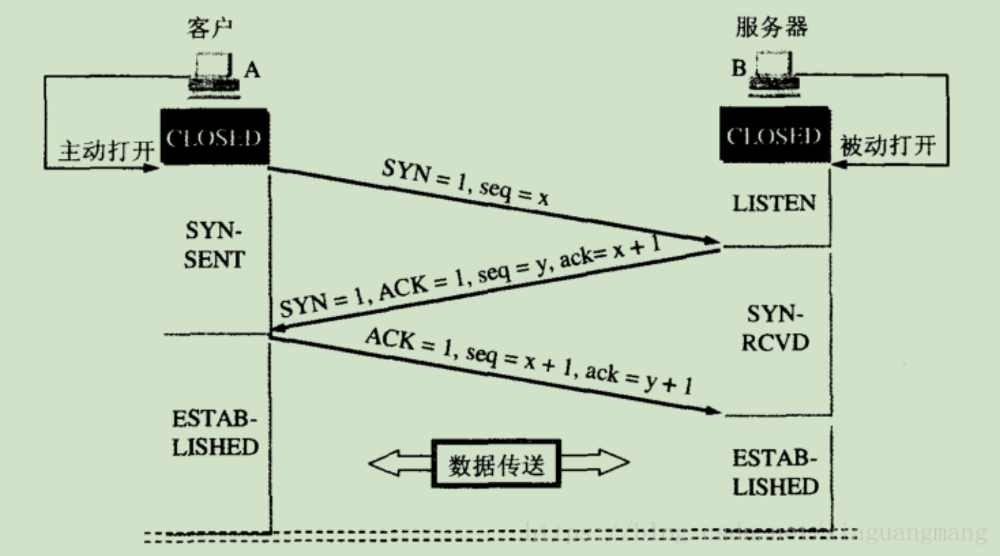
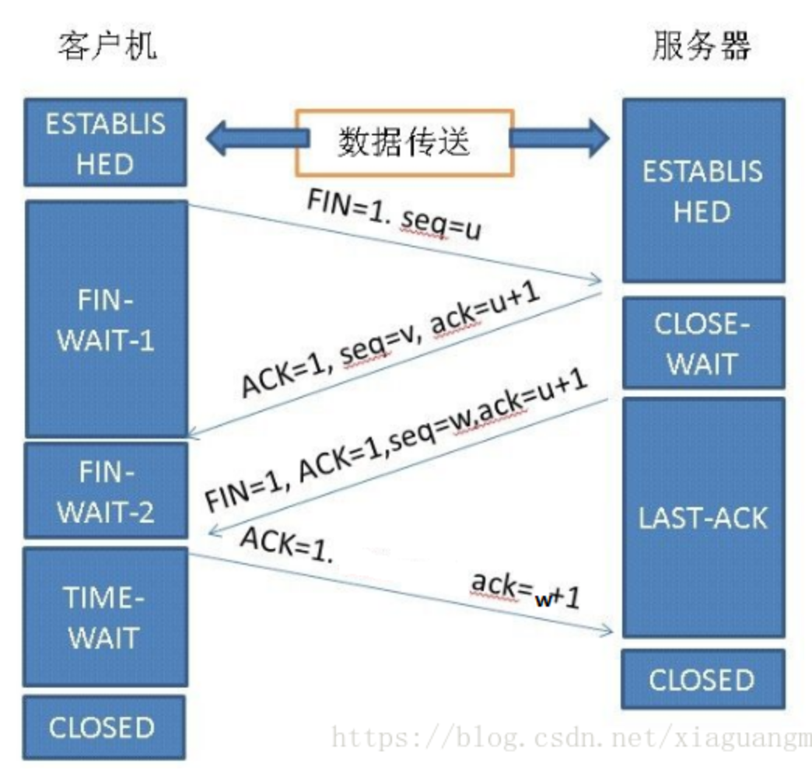

# 三次握手

```
1.第一次握手：客户A发送位码SYN=1，随机产生seq=x 的数据包到服务器B，服务器B有SYN=1知道，客户A要求建立联机，此时客户A进入SYN_SENT状态，等待服务器B确认；
2.第二次握手：服务器B收到确认请求后要确认联机信息，向客户A发送ack=x+1（即seq+1）,seq=y，ACK=1,SYN=1，此时服务器B相当于为客户A做确认的同时发送了一个自己的seq需要客户A做确认，服务器B进入SYN_RECV状态；
3.第三次握手：客户A收到后检查ack是否正确（即自己发送的seq+1）并确认ACK=1，若正确，客户A再想服务器B发送ACK=1,seq=x+1,ack=y+1，服务器B收到后确认seq（是否等于自己发送的ack）ack(是否是自己发送的 seq+1)并且ACK=1则连接建立成功。此时服务器进入ESTABLISHED状态，意味着 可以开始数据传输了。
```




# 四次挥手

```
1.客户机主动请求关闭连接，向服务器发送一个FIN=1（用来关闭客户机到服务器的数据传送）,seq=u（随机序列号），客户机进入FIN_WAIT1状态；
2.服务器收到该报文后回应一个报文，ACK=1,ack=u+1,seq=v，服务器进入CLOSE_WAIT状态，客户机收到服务器回复后进入FIN_WAIT2状态；
3.服务器查看自身是否有未发送或者待发送的数据，若无，服务器被动关闭连接，向客户机发送FIN报文，FIN=1,ACK=1,seq=w,ack=u+1。若有待传输的数据，执行完后再发送FIN报文；
4.客户机收到服务器的FIN报文后，随机发送ACK报文确认，ACK=1,ack=w+1，客户机进入TIME_WAIT状态（用于可靠地终止TCP连接，保证让迟来的TCP报文段有足够短的时间被 识别并丢弃），待两个MSL（报文最大生存时间，保证本次连接的所有数据从网络中消失，避免出现粘包现像）后进入CLOSED状态，服务器收到ACK=1后进入CLOSED状态。
```


