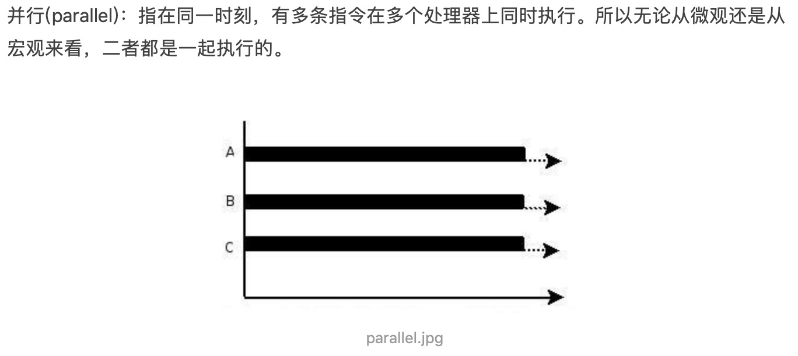
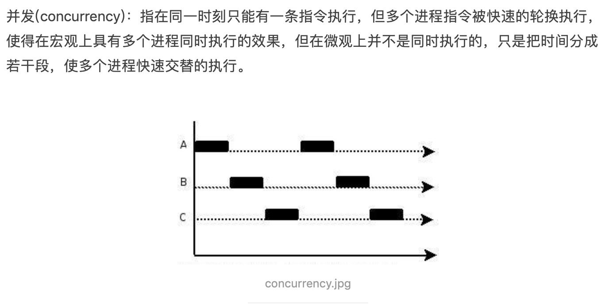

# 一些常识


## 高并发

```
你吃饭吃到一半，电话来了，你一直到吃完了以后才去接，这就说明你不支持并发也不支持并行。
你吃饭吃到一半，电话来了，你停了下来接了电话，接完后继续吃饭，这说明你支持并发。
你吃饭吃到一半，电话来了，你一边打电话一边吃饭，这说明你支持并行。

并发的关键是你有处理多个任务的能力，不一定要同时。
并行的关键是你有同时处理多个任务的能力。

并发，一个任务执行完执行下一个任务；
并行，在用同一个时刻执行多个任务；
```

```
1. 什么是高并发（High Concurrency）
　　高并发（High Concurrency）是互联网分布式系统架构设计中必须考虑的因素之一，它通常是指，通过设计保证系统能够同时并行处理很多请求。
简单点就是在同一时刻不同用户访问同一资源的问题；

2. 高并发相关常用的一些指标 
　　响应时间（Response Time：系统对请求做出响应的时间。例如系统处理一个HTTP请求需要200ms，这个200ms就是系统的响应时间。
　　吞吐量（Throughput）：单位时间内处理的请求数量。
　　QPS：每秒响应请求数。在互联网领域，这个指标和吞吐量区分的没有这么明显。
　　并发用户数：同时承载正常使用系统功能的用户数量。例如一个即时通讯系统，同时在线量一定程度上代表了系统的并发用户数。
```




```
并行在多处理器系统中存在，而并发可以在单处理器和多处理器系统中都存在，并发能够在单处理器系统中存在是因为并发是并行的假象，并行要求程序能够同时执行多个操作，而并发只是要求程序假装同时执行多个操作（每个小时间片执行一个操作，多个操作快速切换执行）。
```

```
多线程多进程都可以实现高并发
```
