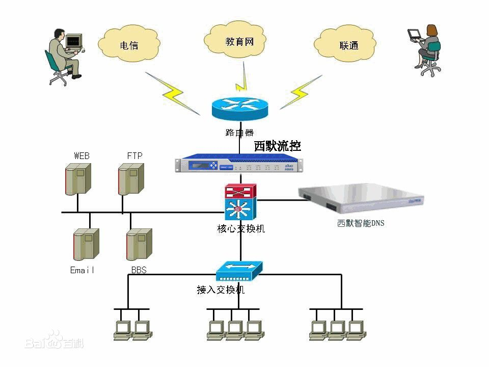

# title1

## title2

### title3

- content

```
This is a test document.
```

* haha
    * haha
        * ha`ha`

* web: [百度](https://www.baidu.com)

### img1
<div align=center>

 
### img2
<div align=center>


```
云服务器创建成功

尊敬的腾讯云用户，您好！
您（账号ID：100012514854，昵称：Master）的云服务器（共1台）已创建成功（订单号：20191221208041），感谢您对腾讯云的支持！
服务器操作系统为 Ubuntu Server 18.04.1 LTS 64位，默认账户为 ubuntu，初始密码为 k$W-)6T.4q@zAL

可用区: 上海二区
配置: 标准型S4/1核/2GB/1Mbps
系统盘: 高效云硬盘/50GB
网络类型: 私有网络
IP地址:
    111.229.19.133（公）
    172.17.0.5（内）

温馨提醒：
1.云服务器可以进行登录（Windows/Linux）、关机 、重启 、配置调整、重装系统等操作。如果您忘记登录密码，您可以重置云服务器密码。更多操作请参考云服务器操作指南。
2.如果您购买了数据盘，建议在服务器创建后首次登录时，手动进行磁盘分区格式化操作。具体请参考挂载磁盘到云服务器。
3.若网站用于WEB访问，请及时在腾讯云进行备案；已在其他接入商处完成备案，仍需在腾讯云完成接入备案，点击了解详情。
```