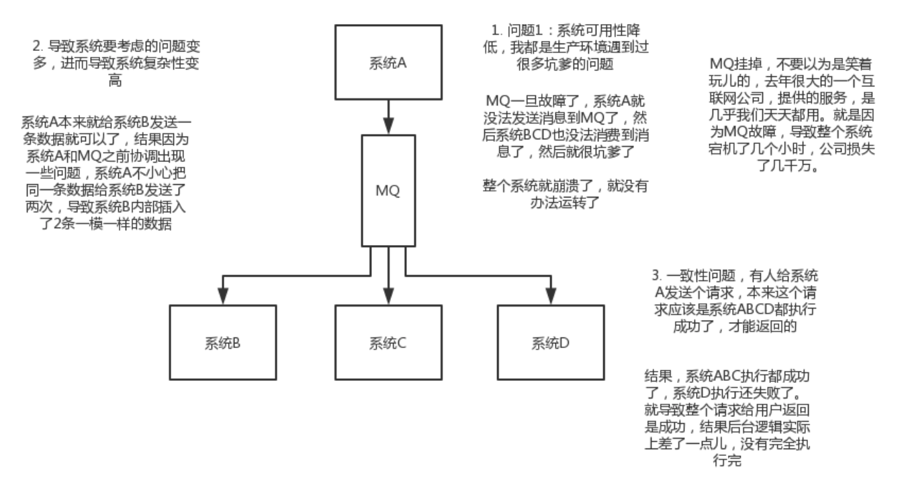

# kafka

* [消息队列-kafka](https://www.cnblogs.com/laojiao/p/9573016.html)
* [kafka下载地址](http://kafka.apache.org) (注意: 要下载Binary downloads里面的)
* [kafka安装及部署](https://blog.csdn.net/lemonZhaoTao/article/details/84455588)
* [kafka与zookeeper](https://blog.csdn.net/weixin_38750084/article/details/82944759)
* [kafka的producer/consumer/broker](https://blog.csdn.net/u010020099/article/details/82290403)


## 为什么使用消息队列

```
使用场景很多，比较核心的有 解耦/异步/削峰。
```

### 解耦

<div align=center>

 
<div align=center>


```
A系统发送个数据到BCD三个系统，接口调用发送，那如果E系统也要这个数据呢？那如果C系统现在不需要了呢？现在A系统又要发送第二种数据了呢？A系统负责人濒临崩溃中。。。再来点更加崩溃的事儿，A系统要时时刻刻考虑BCDE四个系统如果挂了咋办？我要不要重发？我要不要把消息存起来？头发都白了啊...

一个系统或者一个模块，调用了多个系统或者模块，互相之间的调用很复杂，维护起来很麻烦。但是其实这个调用是不需要直接同步调用接口的，如果用MQ给他异步化解耦，也是可以的，你就需要去考虑在你的项目里，是不是可以运用这个MQ去进行系统的解耦。在简历中体现出来这块东西，用MQ作解耦。
```


### 异步

<div align=center>

 
<div align=center>


```
A系统接收一个请求，需要在自己本地写库，还需要在BCD三个系统写库，自己本地写库要3ms，BCD三个系统分别写库要300ms、450ms、200ms。最终请求总延时是3 + 300 + 450 + 200 = 953ms，接近1s，用户感觉搞个什么东西，慢死了慢死了。
```


### 削峰

<div align=center>

 
<div align=center>


```
每天0点到11点，A系统风平浪静，每秒并发请求数量就100个。结果每次一到11点~1点，每秒并发请求数量突然会暴增到1万条。但是系统最大的处理能力就只能是每秒钟处理1000个请求啊。。。尴尬了，系统会死...
```

## 缺点

<div align=center>



### 系统可用性降低

```
系统引入的外部依赖越多，越容易挂掉，本来你就是A系统调用BCD三个系统的接口就好了，人ABCD四个系统好好的，没啥问题，你偏加个MQ进来，万一MQ挂了咋整？MQ挂了，整套系统崩溃了，你不就完了么。
```


### 系统复杂性提高

```
硬生生加个MQ进来，你怎么保证消息没有重复消费？怎么处理消息丢失的情况？怎么保证消息传递的顺序性？头大头大，问题一大堆，痛苦不已
```
 

### 一致性问题

```
A系统处理完了直接返回成功了，人都以为你这个请求就成功了；但是问题是，要是BCD三个系统那里，BD两个系统写库成功了，结果C系统写库失败了，咋整？你这数据就不一致了。
```

### 注释

```
所以消息队列实际是一种非常复杂的架构，你引入它有很多好处，但是也得针对它带来的坏处做各种额外的技术方案和架构来规避掉，最好之后，你会发现，妈呀，系统复杂度提升了一个数量级，也许是复杂了10倍。但是关键时刻，用，还是得用的。。。
```


## 常见mq(kafka、activemq、rabbitmq、rocketmq)优缺点

### ActiveMQ

```
单机吞吐量:
    万级，吞吐量比RocketMQ和Kafka要低了一个数量级。

topic数量对吞吐量的影响:
    
时效性:
    ms级。

可用性:
    高，基于主从架构实现高可用性。

消息可靠性:
    有较低的概率丢失数据。

功能支持:
    MQ领域的功能极其完备。

优劣势总结:
    非常成熟，功能强大，在业内大量的公司以及项目中都有应用
    偶尔会有较低概率丢失消息
    而且现在社区以及国内应用都越来越少，官方社区现在对ActiveMQ 5.x维护越来越少，几个月才发布一个版本
    而且确实主要是基于解耦和异步来用的，较少在大规模吞吐的场景中使用
```

### RabbitMQ

```
单机吞吐量:
    万级，吞吐量比RocketMQ和Kafka要低了一个数量级。

topic数量对吞吐量的影响:

时效性:
    微秒级，这是rabbitmq的一大特点，延迟是最低的。

可用性:
    高，基于主从架构实现高可用性。

消息可靠性:
    基于erlang开发，所以并发能力很强，性能极其好，延时很低。

功能支持:

优劣势总结:
    erlang语言开发，性能极其好，延时很低；
    吞吐量到万级，MQ功能比较完备
    而且开源提供的管理界面非常棒，用起来很好用
    社区相对比较活跃，几乎每个月都发布几个版本分
    在国内一些互联网公司近几年用rabbitmq也比较多一些
    但是问题也是显而易见的，RabbitMQ确实吞吐量会低一些，这是因为他做的实现机制比较重
    而且erlang开发，国内有几个公司有实力做erlang源码级别的研究和定制？如果说你没这个实力的话，确实偶尔会有一些问题，你很难去看懂源码，你公司对这个东西的掌控很弱，基本职能依赖于开源社区的快速维护和修复bug
    而且rabbitmq集群动态扩展会很麻烦，不过这个我觉得还好。其实主要是erlang语言本身带来的问题。很难读源码，很难定制和掌控
```

### RocketMQ

```
单机吞吐量:
    10万级，RocketMQ也是可以支撑高吞吐的一种MQ。

topic数量对吞吐量的影响:
    topic可以达到几百，几千个的级别，吞吐量会有较小幅度的下降。
    这是RocketMQ的一大优势，在同等机器下，可以支撑大量的topic。
    
时效性:
    ms级。

可用性:
    非常高，分布式架构。

消息可靠性:
    经过参数优化配置，可以做到0丢失。

功能支持:
    MQ功能较为完善，还是分布式的，扩展性好。

优劣势总结:
    接口简单易用，而且毕竟在阿里大规模应用过，有阿里品牌保障
    日处理消息上百亿之多，可以做到大规模吞吐，性能也非常好，分布式扩展也很方便，社区维护还可以，可靠性和可用性都是ok的，还可以支撑大规模的topic数量，支持复杂MQ业务场景
    而且一个很大的优势在于，阿里出品都是java系的，我们可以自己阅读源码，定制自己公司的MQ，可以掌控
    社区活跃度相对较为一般，不过也还可以，文档相对来说简单一些，然后接口这块不是按照标准JMS规范走的有些系统要迁移需要修改大量代码
    还有就是阿里出台的技术，你得做好这个技术万一被抛弃，社区黄掉的风险，那如果你们公司有技术实力我觉得用RocketMQ挺好的
```

### Kafka

```
单机吞吐量:
    10万级别，这是kafka最大的优点，就是吞吐量高。
    一般配合大数据类的系统来进行实时数据计算、日志采集等场景。

topic数量对吞吐量的影响:
    topic从几十个到几百个的时候，吞吐量会大幅度下降。
    所以在同等机器下，kafka尽量保证topic数量不要过多。如果要支撑大规模topic，需要增加更多的机器资源。

时效性:
    延迟在ms级以内。
    
可用性:
    非常高，kafka是分布式的，一个数据多个副本，少数机器宕机，不会丢失数据，不会导致不可用。

消息可靠性:
    经过参数优化配置，消息可以做到0丢失。

功能支持:
    功能较为简单，主要支持简单的MQ功能，在大数据领域的实时计算以及日志采集被大规模使用，是事实上的标准。

优劣势总结:
    kafka的特点其实很明显，就是仅仅提供较少的核心功能，但是提供超高的吞吐量，ms级的延迟，极高的可用性以及可靠性，而且分布式可以任意扩展
    同时kafka最好是支撑较少的topic数量即可，保证其超高吞吐量
    而且kafka唯一的一点劣势是有可能消息重复消费，那么对数据准确性会造成极其轻微的影响，在大数据领域中以及日志采集中，这点轻微影响可以忽略
    这个特性天然适合大数据实时计算以及日志收集
```


## 总结

```
一般的业务系统要引入MQ，最早大家都用ActiveMQ，但是现在确实大家用的不多了，没经过大规模吞吐量场景的验证，社区也不是很活跃，所以大家还是算了吧，我个人不推荐用这个了。
后来大家开始用RabbitMQ，但是确实erlang语言阻止了大量的java工程师去深入研究和掌控他，对公司而言，几乎处于不可控的状态，但是确实人是开源的，比较稳定的支持，活跃度也高。
不过现在确实越来越多的公司，会去用RocketMQ，确实很不错，但是我提醒一下自己想好社区万一突然黄掉的风险，对自己公司技术实力有绝对自信的，我推荐用RocketMQ，否则回去老老实实用RabbitMQ吧，人是活跃开源社区，绝对不会黄。
所以中小型公司，技术实力较为一般，技术挑战不是特别高，用RabbitMQ是不错的选择；大型公司，基础架构研发实力较强，用RocketMQ是很好的选择。
如果是大数据领域的实时计算、日志采集等场景，用Kafka是业内标准的，绝对没问题，社区活跃度很高，绝对不会黄，何况几乎是全世界这个领域的事实性规范。
```


## kafka常用命令

```
./kafka-server-start.sh ../config/server.properties 
./kafka-console-producer.sh --broker-list 127.0.0.1:9092 --topic test
./kafka-console-consumer.sh --bootstrap-server 127.0.0.1:9092 --topic test
```
