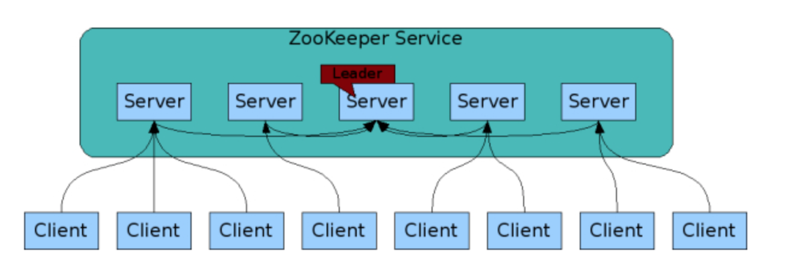

# zookeeper(分布式应用程序协调服务)

```
它是一个为分布式应用提供一致性服务的软件。(提供的功能包括: 同步服务、配置维护、命名服务等)
它被设计为易于编程，使用文件系统目录树作为数据模型。
```

<div align=center>

<br/>

* [zookeeper下载地址](http://mirror.bit.edu.cn/apache/zookeeper/)
* [JDK下载地址](https://www.oracle.com/technetwork/java/javase/downloads/index.html)
* [zookeeper应用](https://www.cnblogs.com/dream-to-pku/p/9513188.html)


## 设计目的

```
最终一致性：
    client不论连接到那个Server，展示给它的都是同一个视图。
    
可靠性：
    具有简单、健壮、良好的性能、如果消息m被到一台服务器接收，那么消息m将被所有服务器接收。
    
实时性：
    Zookeeper保证客户端将在一个时间间隔范围内获得服务器的更新信息，或者服务器失效的信息。但由于网络延时等原因，Zookeeper不能保证两个客户端能同时得到刚更新的数据，如果需要最新数据，应该在读数据之前调用sync()接口。

等待无关(wait-free)：
    慢的或者失效的client不得干预快速的client的请求，使得每个client都能有效的等待。

原子性：
    更新只能成功或者失败，没有中间状态。

顺序性：
    包括全局有序和偏序两种：全局有序是指如果在一台服务器上消息a在消息b前发布，则在所有Server上消息a都将在消息b前被发布；偏序是指如果一个消息b在消息a后被同一个发送者发布，a必将排在b前面。
```


## 安装步骤

```
1. 解压安装包
    解压下载得到的ZooKeeper压缩包，发现有bin，conf，lib等目录。
    bin目录中存放有运行脚本；
    conf目录中存放有配置文件；
    lib目录”中存放有运行所需要第三方库。

2. 安装java JDK

3. 运行脚本相关(在bin目录下)

    服务端相关:
        ./zkServer.sh start (xxx.cfg)
        ./zkServer.sh status (xxx.cfg)
        ./zkServer.sh stop (xxx.cfg)
        
    客户端相关:
        ./zkCli.sh -server localhost:2181
```


## 配置解析

```
# 服务器与客户端之间交互的基本时间单元(ms). 
tickTime=2000   

# zookeeper所能接受的客户端数量.
initLimit=10  

# 服务器和客户端之间请求和应答之间的时间间隔.
syncLimit=5

# zookeeper中使用的基本时间单位, 毫秒值.
tickTime=2000

# 数据目录. 可以是任意目录.
dataDir=/tmp/zookeeper/data

# log目录, 同样可以是任意目录. 如果没有设置该参数, 将使用和#dataDir相同的设置.
dataLogDir=/tmp/zookeeper/log

# 监听client连接的端口号.
clientPort=2181

server.1=localhost:2888:3888
server.2=localhost:2899:3899
server.3=localhost:2877:3877
```

```
server.A=B:C:D
    A：其中 A 是一个数字，表示这个是服务器的编号
    B：是这个服务器的ip地址
    C：Leader选举的端口
    D：Zookeeper服务器之间的通信端口
```


## 工作原理

```
在zookeeper的集群中，各个节点共有下面3种角色和4种状态：
    角色：leader,follower,observer
    状态：leading,following,observing,looking

Zookeeper的核心是原子广播，这个机制保证了各个Server之间的同步。实现这个机制的协议叫做Zab协议（ZooKeeper Atomic Broadcast protocol）。Zab协议有两种模式，它们分别是恢复模式（Recovery选主）和广播模式（Broadcast同步）。当服务启动或者在领导者崩溃后，Zab就进入了恢复模式，当领导者被选举出来，且大多数Server完成了和leader的状态同步以后，恢复模式就结束了。状态同步保证了leader和Server具有相同的系统状态。
为了保证事务的顺序一致性，zookeeper采用了递增的事务id号（zxid）来标识事务。所有的提议（proposal）都在被提出的时候加上了zxid。实现中zxid是一个64位的数字，它高32位是epoch用来标识leader关系是否改变，每次一个leader被选出来，它都会有一个新的epoch，标识当前属于那个leader的统治时期。低32位用于递增计数。

每个Server在工作过程中有4种状态：
    LOOKING：当前Server不知道leader是谁，正在搜寻。
    LEADING：当前Server即为选举出来的leader。
    FOLLOWING：leader已经选举出来，当前Server与之同步。
    OBSERVING：observer的行为在大多数情况下与follower完全一致，但是他们不参加选举和投票，而仅仅接受(observing)选举和投票的结果。
```


## 注意事项

```
Zookeeper节点部署越多，服务的可靠性越高，建议部署奇数个节点，因为zookeeper集群是以宕机个数过半才会让整个集群宕机的。
```


## 客户端命令操作

### 检查

```
echo stat|nc localhost 2181
连接客户端后执行stat命令相同
```

```
help        显示所用操作命令
ls path     使用ls命令查看当前znode中所包含的内容
create      普通创建(永久节点) -e(临时节点，重启或超时消失) -s(含有序列)
get path    获得节点的值
set         设置节点的具体值
stat        查看节点的具体值
delete      删除节点
rmr         递归删除节点
quit        退出客户端
```

```
help
ls /
create -s -e /zk3 123
get /zk
set /zk qwe
stat /zk
delete /zk2
rmr /zk
quit
```


## 使用python操作zookeeper

```
pip install kazoo
```


## 实例

* [zookeeper实例](https://www.cnblogs.com/bethal/p/5459020.html)
* [python操作zookeeper 1](https://www.cnblogs.com/xiao987334176/p/10103619.html)
* [python操作zookeeper 2](https://blog.51cto.com/chenx1242/2053627)
