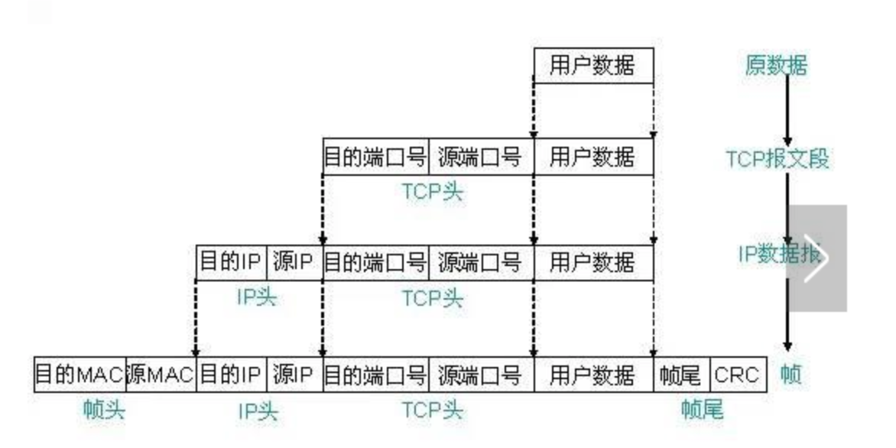

# 网络相关


## 网络定义

```
局域网:(Local Area Network, LAN)
    局域网是一个局部范围的计算计组，比如家庭网络就是一个小型的局域网，里面包含电脑、手机和平板等，他们共同连接到你家的路由器上。又比如学校的机房就是一个局域网，里面有几百几千台电脑，当机房无法上外网时，但是电脑之间仍可以通信，你们可以通过这个局域网来打CS 、玩红警。理论上，局域网是封闭的，并不可以上外网，可以只有两台电脑，也可以有上万台。

广域网:(Wide Area Network, WAN)
    广域网的范围就比较大了，可以把你家和别人家、各个省、各个国家连接起来相互通信。广域网和局域网都是从范围的角度来划分的，广域网也可以看成是很多个局域网通过路由器等相互连接起来。

互联网:(internet)
    互联网可以看成是局域网、广域网等组成的一个最大的网络，它可以把世界上各个地方的网路都连接起来，个人、政府、学校、企业，只要你能想到的，都包含在内。互联网是一种宽泛的概念，是一个极其庞大的网络。
```

```
因特网:(Internet)(使用TCP/IP协议让不同的设备可以彼此通信)
    它是指当前全球最大的、开放的、有众多网络互相连接而成的特定的计算机网络，它采用TCP/IP协议族作为通信的规则，其前身是美国的ARPNET。
    因特网使用TCP/IP协议让不同的设备可以彼此通信，但使用TCP/IP协议的网络不一定是因特网，例如: 局域网。

万维网:(world wide web)
    因特网提供的一种服务。WWW的成功在于它制定了一套标准的、易为人们掌握的超文本开发语言HTML、统一资源定位器URL和超文本传送协议HTTP。
```

```
以太网:(Ethernet)(是一种局域网技术)
    以太网可以看成是一种实现局域网通信的技术标准，是目前最广泛的局域网技术。
```


## 什么是协议

```
为了使数据可以在网络上从源传递到目的地，网络上所有设备需要"讲"相同的"语言"，描述网络通信中"语言"规范的一组规则就是协议。
```


## 为什么协议要分层

```
为了降低网络设计的复杂性，将协议进行了分层设计。使各层只需关心自己的工作即可，而不必去关心其他层。
```


### OSI参考模型(七层)

```
层级从高至低，由第7层 -> 第1层:(下层对上层提供服务)

应用层
表示层
会话层
传输层
网络层
数据链路层
物理层
```

<div align=center>

<br/>


### TCP/IP模型(5层)

```
Internet网络体系结构以TCP/IP通信协议为核心。
```

```
层级从高至低，由第5层 -> 第1层:(下层对上层提供服务)

应用层: 如FTP(文件传输协议)、HTTP(超文本传输协议)、SMTP(简单邮件传输协议)、POP3(邮局协议)、DNS(域名系统)
传输层: 如TCP(传输控制协议)、UDP(用户数据协议)
互联网层: 如IP(网络协议)
数据链路层: 如SLIP(串行线路IP)、PPP(点到点协议)
物理层: 放大或再生弱的信号，在两个电缆段之间复制每一个比特
```

```
应用层:(为用户提供所需要的各种服务)
    应用层对应于OSI参考模型的高层，为用户提供所需要的各种服务，例如：FTP、Telnet、DNS、SMTP等.　是用户与网络的接口。该层通过应用程序来完成网络用户的应用需求，如文件传输、收发电子邮件等。
    应用层协议可分为3类：
        (1)依赖于TCP的应用协议，如远程终端协议Telnet，文件传输型的电子邮件协议SMTP，文件传输协议FTP，超文本传输协议HTTP，外部网关协议BGP等。
        (2)依赖于UDP的协议，例如单纯文件传输协议TFTP，简单网络管理协议SNMP，域名系统DNS，内部网关协议RIP，动态主机配置协议DHCP和引导程序协议BOOTP等。
        (3)依赖于TCP和UDP的协议，如通信用管理信息协议CMOT。当然，一些没有标准化的建立在TCP/ IP协议簇之上的用户应用程序（或专用程序）也属于应用层。

传输层:
    1、向两个主机中进程之间的通信提供通用的数据传输服务(也就是提供通信服务)
        TCP：面向连接的、可靠的数据传输服务，传输的数据单位是报文段
        UDP：无连接的、尽最大努力的数据传输服务(不可靠的)，数据传输单位是用户数据报
    2、包含的主要协议：TCP协议（Transmission Control Protocol，传输控制协议）、UDP协议（User Datagram Protocol，用户数据报协议）；
    3、重要设备：网关(协议转换器)。

网络层:
    1、主要任务:
        1、分组怎样从一个网络通过路由器转发到另一个网络(网际互连)
        3、把传输层产生的报文段或用户数据报封装成分组或包进行传送(IP数据报)
        4、选择合适的路由，使源主机运输层传下来的分组能够通过网络中的路由器找到目的主机(路由选择)
    2、基本数据单位为IP数据报；
    3、包含的主要协议：
        IP协议（Internet Protocol，因特网互联协议）;
        ICMP协议（Internet Control Message Protocol，因特网控制报文协议）;
        ARP协议（Address Resolution Protocol，地址解析协议）;
        RARP协议（Reverse Address Resolution Protocol，逆地址解析协议）。
    4、重要的设备：路由器(网际互联、路由选择)。

数据链路层:
    1、在同一个局域网中，分组怎样从一个主机传送到另一个主机(不经过路由器)
    2、将网际层交下来的IP数据报组装成帧，在相邻结点间的链路上传送帧
    3、基本数据单位为帧，帧包括的数据：同步信息、地址信息、差错控制等
    4、协议：PPP(点对点协议)
    5、工作:(https://blog.csdn.net/azsx02/article/details/69387317)
        1、封装成帧：数据的前后添加首部和尾部
        2、透明传输：(方法：字节填充法)
        3、差错检测
    6、两个重要设备名称：网桥和交换机(用于连接多台设备,让其具备网络互通的条件)。

物理层:(考虑怎样才能在连接各种计算的传输媒体上传输数据比特流)
    1、物理层为设备之间的数据通信提供传输媒体及互连设备，为数据传输提供可靠的环境, 它利用传输介质为数据链路层提供物理连接。为此，该层定义了物理链路的建立、维护和拆除有关的机械、电气、功能和规程特性。包括信号线的功能、“0”和“1”信号的电平表示、数据传输速率、物理连接器规格及其相关的属性等。
    2、物理层的设备:
        物理层的媒体包括架空明线、平衡电缆、光纤、无线信道等。
        通信用的互连设备指DTE和DCE间的互连设备。
        DTE既数据终端设备，又称物理设备，如计算机、终端等都包括在内。
        而DCE则是数据通信设备或电路连接设备，如调制解调器等。
        数据传输通常是经过DTE──DCE，再经过DCE──DTE的路径。
        互连设备指将DTE、DCE连接起来的装置，如各种插头、插座。LAN中的各种粗、细同轴电缆、T型接头、插头，接收器，发送器，中继器等都属物理层的媒体和连接器。
```


## TCP/IP协议数据封装的过程

```
以传输层采用TCP或者UPD、网络层采用IP、链路层采用Ethernet为例，可以看到TCP/IP中报文的封装过程如图所示。
用户数据经过应用层协议封装后传递给传输层，传输层封装TCP头部，交给网络层，网络层封装IP头部后，再交给数据链路层，数据链路层封装Ethernet帧头和帧尾，交给物理层，物理层以比特流的形式将数据发送到物理线路上。
不同的协议层对数据包有不同的称谓，在传输层叫做段（segment），在网络层叫做数据报（datagram），在链路层叫做帧（frame）。数据封装成帧后发到传输介质上，到达目的主机后每层协议再剥掉相应的首部，最后将应用层数据交给应用程序处理。
```

<div align=center>

<br/>

<div align=center>

<br/>

<div align=center>

<br/>


## 数据包在局域网内传递

<div align=center>

<br/>


## 数据包在广域网内传递

<div align=center>

<br/>

```
这里值得说明的是数据在路由器这里要进行一次解包，以便让路由器获取到它的目的IP地址，这样路由器可以重新进行封装找到数据包下一跳要去的地方。
```

```
数据的整条发送链是：

1、某进程(也就是在应用层)准备好待传输数据，若目的地址是域名则要先通过DNS解析成IP地址
2、交付到运输层(TCP/UDP层)，运输层对数据进行适当的分组等操作，后对每一个分组数组加上首部形成报文段(或用户数据报)首部包括源地址、源端口、目的地址、目的端口和一些其他的诸如校验和等数据
3、交付到网际层(IP层)，对分组数据加上首部形成IP数据报，首部包括源地址、目的地址(跟运输层的目的地址不同，运输层的目的地址是数据要传送的最终地址，而该目的地址是通过路由表信息得出，是该数据下一步该转移的目的计算机)和校验和等数据
4、交付到数据链路层(mac层)，先是对把数据封装成帧(也就是添加首部[SOH]和尾部[EOT])，然后进行透明传输(也就是封装的数据里面，如果出现首部SOH和尾部EOT这样的数据，对其进行转义，也就是加上ESC转义字符，这种方法称为字节/字符填充)
5、交付到物理层，根据数据链路层的mac知道要传输到目的计算机，通过特定的传输介质传送到下一个地址
6、若源主机与最终目的主机在同一个网段，则该地址是最终的目的主机，开始接收数据，进入第7步骤，若源主机和最终目的主机不在同一个网段，进入第11步骤
7、交付到数据链路层，对数据进行卸装，该层会对接收的数据进行差错检测，有差错的数据都会被丢弃
8、交付到IP层，解帧校验
9、交付到运输层，在该主机上，根据端口找到对应的应用，当使用的TCP协议时，提供一种面向连接的可靠的传输服务，可以说是建立了一个虚拟通道，源主机的数据通过该虚拟通道进行传输；若是使用的UDP协议时，提供一种面向的非连接的尽最大努力的不可靠的传输服务，数据传输快，但是无法保证数据100%传输。
10、建立了传输连接后，应用开始接收数据，发送方数据和接收方都必须满足相同的标准应用层协议，如http、ftp、smtp等，通过标准协议应用即可正确的接收源主机发送过来的数据。
11、该计算机不是最终主机，那该计算机就是路由器也就是用于转发分组数据的中转站，首先接收数据的处理同步骤7和8一样，然后接下来的流程又是如同步骤3,
12、如此循环直至找到最终主机，将数据传送到目的应用
```


## 目的主机收到数据包后，经过各层协议栈最后到达应用程序示意图

```
    以太网驱动程序（网卡）首先根据以太网首部中的“上层协议”字段确定该数据帧的有效载荷（payload，指除去协议首部之外实际传输的数据）是IP、ARP还是RARP协议的数据报，然后交给相应的协议处理。
    假如是IP数据报，IP协议再根据IP首部中的“上层协议”字段确定该数据报的有效载荷是TCP、UDP、ICMP还是IGMP，然后交给相应的协议处理。
    假如是TCP段或UDP段，TCP或UDP协议再根据TCP首部或UDP首部的“端口号”字段确定应该将应用层数据交给哪个用户进程。
    IP地址是标识网络中不同主机的地址，而端口号就是同一台主机上标识不同进程的地址，IP地址和端口号合起来标识网络中唯一的进程。

    注意:
        虽然IP、ARP和RARP数据报都需要以太网驱动程序来封装成帧，但是从功能上划分，ARP和RARP属于链路层，IP属于网络层。
        虽然ICMP、IGMP、TCP、UDP的数据都需要IP协议来封装成数据报，但是从功能上划分，ICMP、IGMP与IP同属于网络层，TCP和UDP属于传输层。
```

<div align=center>

<br/>

* [参考网址](https://blog.csdn.net/qq_32563713/article/details/81514061)
