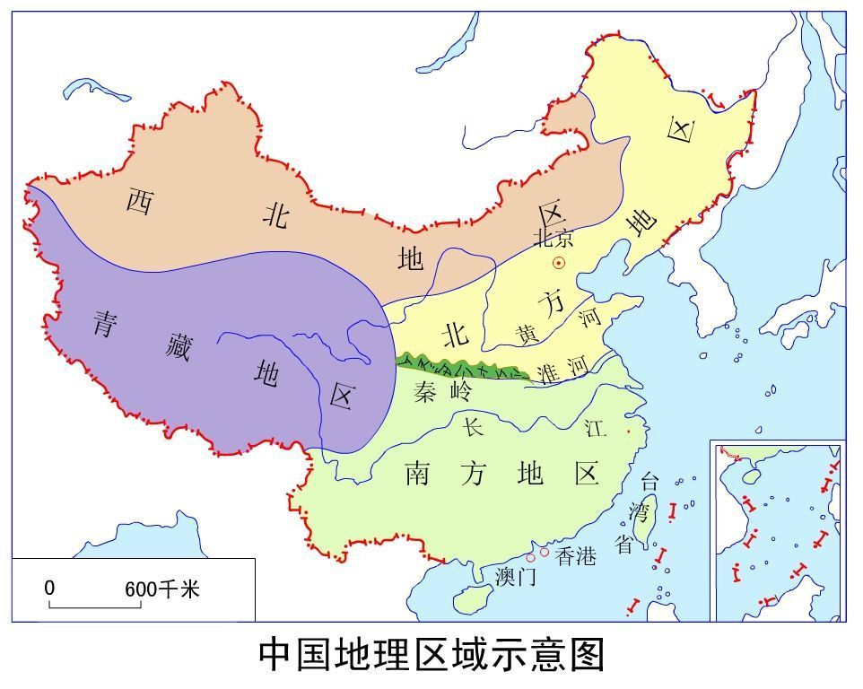

# 中国地理


## 省级行政区

```
直辖市(4个)：    北京市/天津市/上海市/重庆市.
省份(23个)：    河北省/山西省/辽宁省/吉林省/黑龙江省/江苏省/浙江省/安徽省/福建省/江西省/山东省/河南省/湖北省/湖南省/广东省/海南省/四川省/贵州省/云南省/陕西省/甘肃省/青海省/台湾省.
自治区(5个)：    内蒙古自治区/广西壮族自治区/西藏自治区/宁夏回族自治区/新疆维吾尔自治区.
特别行政区(2个)：香港特别行政区/澳门特别行政区.
```

## 中国各省省会城市(28个)

```
河北-石家庄市
山西-太原市
内蒙古-呼和浩特市
辽宁-沈阳市
吉林-长春市
黑龙江-哈尔滨市
江苏-南京市
浙江-杭州市
安徽-合肥市
福建-福州市
江西-南昌市
山东-济南市
河南-郑州市
湖北-武汉市
湖南-长沙市
广东-广州市
广西-南宁市
海南-海口市
四川-成都市
贵州-贵阳市
云南-昆明市
西藏-拉萨市
陕西-西安市
甘肃-兰州市
青海-西宁市
宁夏-银川市
新疆-乌鲁木齐市
台湾-台北市
```




