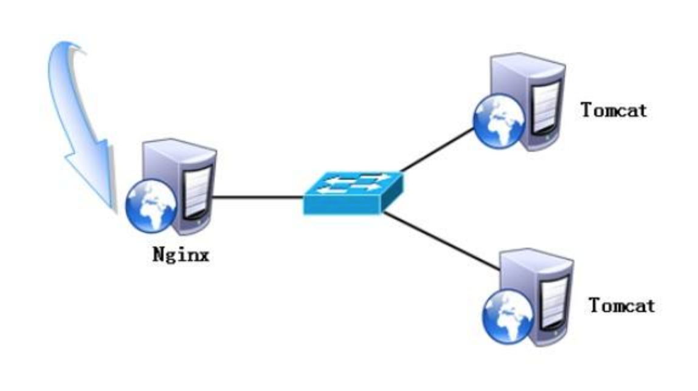
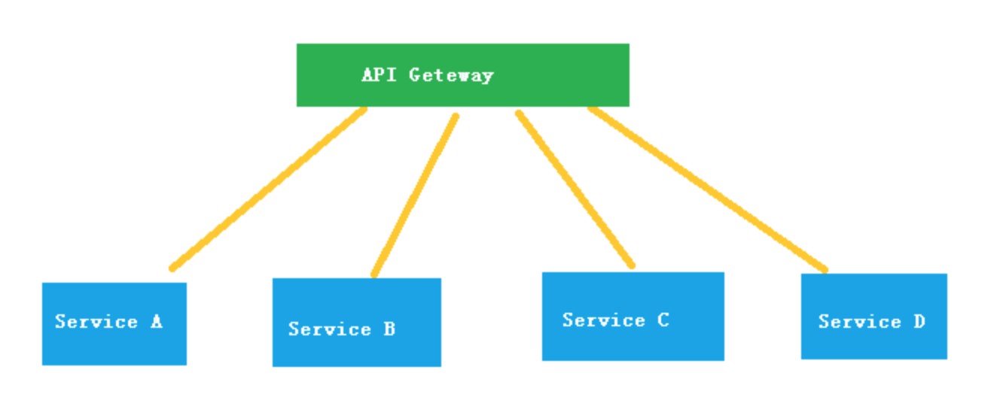
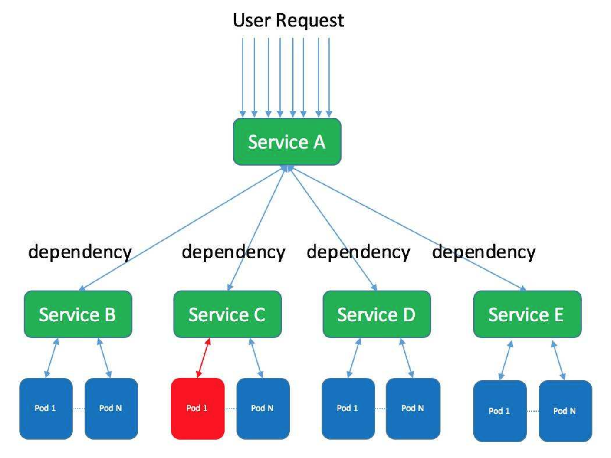
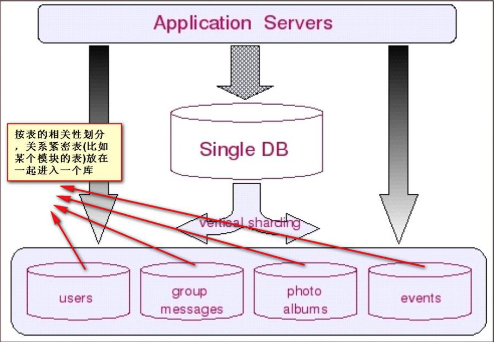
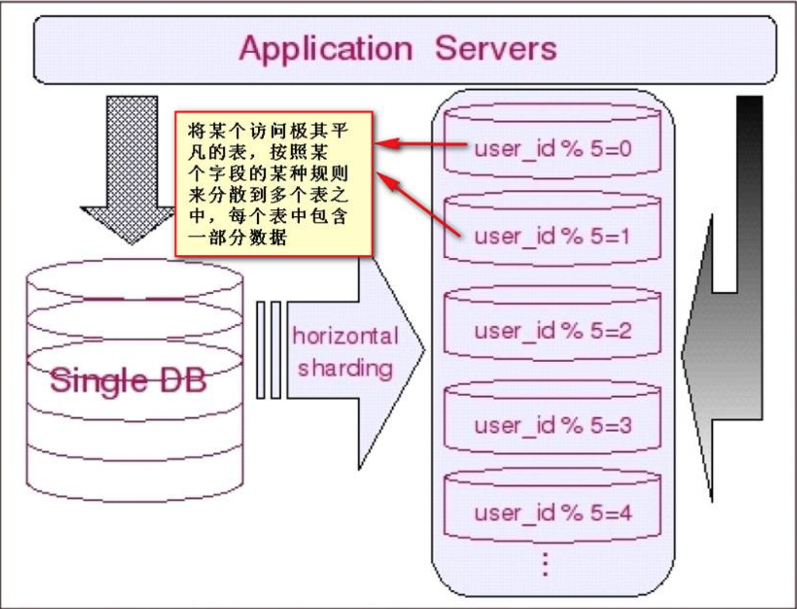
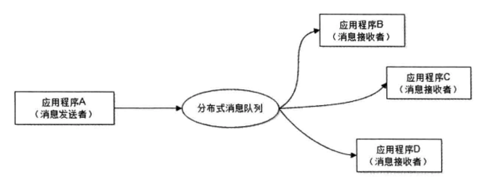

# 性能


## 性能指标

- 响应时间

```
指某个请求从发出到接收到响应消耗的时间。

在对响应时间进行测试时，通常采用重复请求的方式，然后计算平均响应时间。
```

- 吞吐量

```
指系统在单位时间内可以处理的请求数量，通常使用每秒的请求数来衡量。
```

- 并发用户数

```
指系统能同时处理的并发用户请求数量。
```

```
在没有并发存在的系统中，请求被顺序执行，此时响应时间为吞吐量的倒数。
```

```
并发用户数不是越高越好，因为如果并发用户数太高，系统来不及处理这么多请求，会使得过多的请求需要等待，那么响应时间就会大大提高。
```


## 性能优化

- 集群

```
将多台服务器组成集群，使用负载均衡将请求转发到集群中，避免单一服务器的负载压力过大导致性能降低。
```

- 缓存

```
缓存能够提高性能的原因如下:
    缓存数据通常位于内存等介质中，这种介质对于读操作特别快；
    缓存数据可以位于靠近用户的地理位置上；
    可以将计算结果进行缓存，从而避免重复计算。
```

- 异步

```
某些流程可以将操作转换为消息，将消息发送到消息队列之后立即返回，之后这个操作会被异步处理。
```

- 集群、分布式、微服务(补充)

```
集群是个物理形态，分布式是个工作方式。

集群: 同一个业务，部署在多个服务器上。
分布式: 一个业务分拆为多个子业务，部署在不同的服务器上。

分布式是以缩短单个任务的执行时间来提升效率的。
集群则是通过提高单位时间内执行的任务数来提升效率。
```

```
微服务是一种架构风格，一个大型复杂软件应用由一个或多个微服务组成。

微服务的设计是为了不因为某个模块的升级和BUG影响现有的系统业务。

微服务与分布式的细微差别是，微服务的应用不一定是分散在多个服务器上，也可以是同一个服务器。

分布式属于微服务的一种。它们的架构很相似，只是部署的方式不一样而已。
```








# 伸缩性

```
指不断向集群中添加服务器来缓解不断上升的用户并发访问压力和不断增长的数据存储需求。
```

- 伸缩性与性能

```
如果系统存在性能问题，那么单个用户的请求总是很慢。

如果系统存在伸缩性的问题，那么单个用户的请求可能会很快，但是在并发数很高的情况下系统会很慢。
```

- 实现伸缩性

```
应用服务器只要不具有状态，那么就可以很容易地通过负载均衡器向集群中添加新的服务器。

对于非关系型数据库，它们天生就是为海量数据而诞生，对伸缩性的支持特别好。

对于关系型数据库，其伸缩性通过Sharding来实现，将数据按一定的规则分布到不同的节点上，从而解决单台存储服务器的存储空间限制。
```

- Sharding(补充)

```
Sharding的基本思想就要把一个数据库切分成多个部分放到不同的数据库(server)上，从而缓解单一数据库的性能问题。
    不太严格的讲，对于海量数据的数据库，如果是因为表多而数据多，这时候适合使用垂直切分，即把关系紧密（比如同一模块）的表切分出来放在一个server上。
    如果表并不多，但每张表的数据非常多，这时候适合水平切分，即把表的数据按某种规则（比如按ID散列）切分到多个数据库(server)上。
    当然，现实中更多是这两种情况混杂在一起，这时候需要根据实际情况做出选择，也可能会综合使用垂直与水平切分。
```






# 扩展性

```
指的是添加新功能时对现有系统的其它应用无影响，这就要求不同应用具备低耦合的特点。
```

```
实现可扩展主要有两种方式(降低耦合度):
    使用消息队列进行解耦；
    使用分布式服务降低各业务间的耦合度。
```

- 消息队列(补充)



```
图中的消息队列利用发布-订阅模式工作，消息发送者发布消息，一个或者多个消息接收者订阅消息。

对新增业务，只要对该类消息感兴趣，即可订阅该消息，对原有系统和业务没有任何影响，从而实现网站业务的可扩展设计。

由于消息发送者不需要等待消息接收者处理数据就可以返回，系统具有更好的响应延迟；
同时，在网站访问高峰，消息可以暂时存储在消息队列中等待消息接收者根据自身负载处理能力控制消息处理速度，减轻数据库等后端存储的负载压力。
```

```
消息队列模式: 点对点、发布订阅
```

[消息队列MQ](https://blog.csdn.net/HD243608836/article/details/80217591)


# 可用性

- 冗余

```
保证高可用的主要手段是使用冗余，当某个服务器故障时就请求其它服务器。

应用服务器的冗余比较容易实现，只要保证应用服务器不具有状态，那么某个应用服务器故障时，负载均衡器将该应用服务器原先的用户请求转发到另一个应用服务器上，不会对用户有任何影响。

存储服务器的冗余需要使用主从复制来实现，当主服务器故障时，需要提升从服务器为主服务器，这个过程称为切换。
```

- 监控

```
对 CPU、内存、磁盘、网络等系统负载信息进行监控，当某个信息达到一定阈值时通知运维人员，从而在系统发生故障之前及时发现问题。
```

- 服务降级

```
服务降级是系统为了应对大量的请求，主动关闭部分功能，从而保证核心功能可用。
```


# 安全性

```
要求系统在应对各种攻击手段时能够有可靠的应对措施。
```
